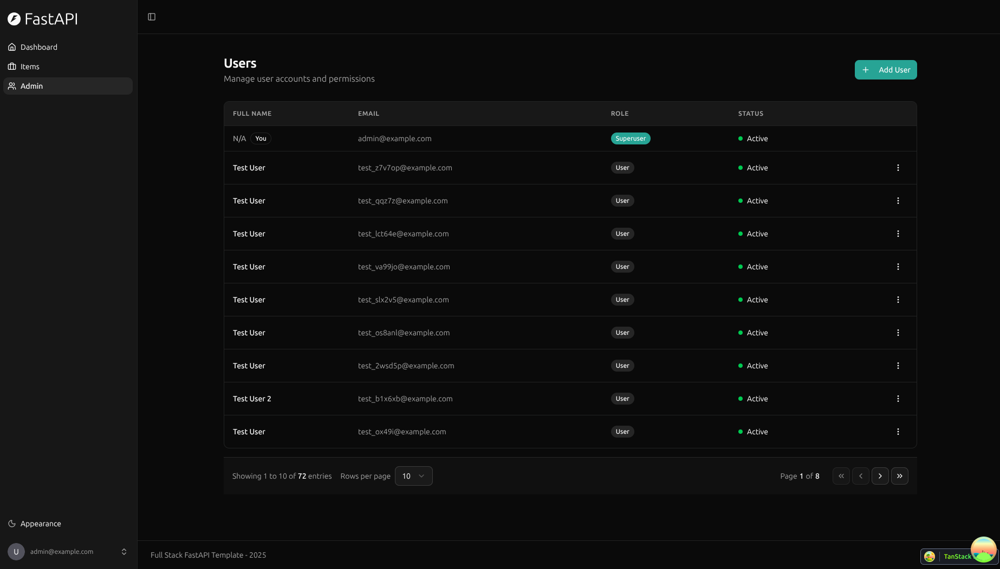

---
# ==========================================
# 系列文章模板 - 用于 Full Stack FastAPI Template
# 使用方法: ./new-chapter.sh "章节标题"
#          .\New-Chapter.ps1 "章节标题"
# ==========================================

# 标题: 自动从文件名生成，将 "-" 替换为空格并转为标题格式[reference:5]
title: "01 初识FastAPI全栈模板_README文件"

# 日期: 自动填充当前时间[reference:6]
date: 2026-06-23T15:40:35+08:00

# 草稿状态: 新文章默认为草稿，防止未完成内容被发布[reference:7]
# draft: true

# 系列名称: 固定值，用于将同一系列的文章关联起来
series: "Full Stack FastAPI Template"

# 章节权重: 控制文章在系列中的显示顺序，数字越小越靠前[reference:8]
# 脚本会自动根据你输入的章节号设置此值
weight: 1

# 章节编号: 便于在文章中引用和显示
chapter: "1"

# 文章描述: 简要介绍本章内容
description: "读README.md文件"

# 封面图片: 建议将图片放在同章节文件夹内，作为页面资源引用[reference:9]
image: "cover.jpg"

# 分类与标签: 用于网站的分类导航
categories: ["project"]
tags: ["FastAPI", "全栈开发", "Python"]

# 其他可选配置
# comments: true   # 是否开启评论
# math: false      # 是否需要数学公式支持
# license: ""      # 文章的特殊许可
# slug: ""         # 自定义URL，若不填则使用文件夹名

---

<!--more-->

## 本章导读

<!-- 在这里写下本章的简要介绍和学习目标 -->
- 读README.md文件
- 拉取项目到本地
- 运行项目


<!-- 从这里开始撰写你的学习笔记 -->

## 一、不使用README.md中的步骤拉取项目到本地(默认已安装Git、Docker和语言环境)

1. 创建一个文件夹，并进入该文件夹
2. 运行命令：`git clone --depth=1 https://github.com/fastapi/full-stack-fastapi-template.git`
    - git clone --depth=1 表示只拉取一次最新的代码，不拉取所有历史记录
3. 进入项目目录：`cd full-stack-fastapi-template`
4. 启动服务器（首次运行会构建镜像，耗时稍长）：`docker compose up -d`/ `docker compose watch`
    > **推荐方式**：`docker compose watch`:这个命令会启动所有服务，并开启“文件监听”模式。当你修改代码时，相关服务会自动重新加载，非常适合开发环境。
    > `docker compose up -d`:这是标准的后台启动模式。但在首次启动时，由于需要构建镜像和初始化数据库，可能需要等待较长时间。如果你只是想在后台运行，也可以使用此命令。


    > 1. 当然直接运行 docker compose up -d **大概率无法直接成功运行**
    > 2. 原因：后端代码里对 SECRET_KEY 做了**强校验**，在 `backend/app/core/config.py` 中找到这段逻辑:
    > `# 代码中明确要求 SECRET_KEY 的长度必须 >= 32 个字符 SECRET_KEY: str = Field( ...,min_length=32,  # 这里强制要求至少32位！description="Secret key for JWT tokens...")`
    >而 `.env` 文件里默认的 `SECRET_KEY=changethis` 只有 9 个字符。当后端容器启动时，Pydantic 进行配置验证会直接抛出 `AssertionError` 或验证失败错误，容器会立刻退出，你连 `http://localhost:8000/docs` 都访问不了
    > 3. **解决方法**：在项目根目录下找到 `.env`文件，必须将以下占位符修改为强密码或你自己的配置:
    > 在backend里 `SECRET_KEY=changethis` ：FastAPI 应用的安全密钥、
    > `FIRST_SUPERUSER_PASSWORD=changethis`: 初始超级管理员的密码、
    > 在postgres里 `POSTGRES_PASSWORD=changethis`:PostgreSQL 数据库的密码，
    > 在终端使用`openssl rand -hex 32`生成一个强密码替换原密码changethis

5. 验证与访问：
   - 后端 API 文档：`http://localhost:8000/docs`
   - 前端界面：`http://localhost:5173`
   - API 交互文档 (Swagger UI)：`http://localhost:8000/docs`
   - 数据库管理 (Adminer)：`http://localhost:8080`
   - 邮件拦截 (Mailcatcher)：`http://localhost:1080`
6. 停止服务器：`docker compose down`

**还报错**：
- 第一步：确认 compose 文件配置正确
    检查根目录下的 compose.yml 和 compose.override.yml（如果有）。backend 和 frontend 服务应该使用 `build` 指令，而不是 `image`。如果你发现 backend 或 frontend 下有 `image: ... `字段，请删除它（或注释掉），确保使用 `build`。
```dockerfile
    backend:
        # image: '${DOCKER_IMAGE_BACKEND?Variable not set}:${TAG-latest}'
        restart: always
        networks:
        - traefik-public
        - default
        ...

    frontend:
        # image: '${DOCKER_IMAGE_FRONTEND?Variable not set}:${TAG-latest}'
        restart: always
        networks:
        - traefik-public
        - default
```
- 第二步：强制构建并启动
    `docker compose up -d --build`
- 如果构建过程中又遇到 429 错误（例如基础镜像拉取失败）配置稳定的镜像加速器或者科学上网,要不就不停的重试5次`docker compose up -d --build`
- 第三步：backend：Dockerfile 中通过 `COPY --from=ghcr.io/astral-sh/uv:0.9.26` 从 GitHub Container Registry（ghcr.io）拉取 uv 的二进制文件。这个拉取步骤失败,直接就修改这一行为`RUN pip install uv==0.9.26`/`RUN pip install -i https://pypi.tuna.tsinghua.edu.cn/simple uv==0.9.26`通过 pip 安装，避免拉取 ghcr.io
- 第四步：frontend: Dockerfile.playwright中 Bun镜像安装失败，所以使用**多阶段构建 (multi-stage build)** 直接复制一下内容替换Dockerfile.playwright
```dockerfile
    # 阶段 1: 使用官方 Bun 镜像来安装依赖
    FROM oven/bun:1 AS bun-builder
    WORKDIR /app

    # 复制依赖配置文件
    COPY package.json bun.lock /app/
    COPY frontend/package.json /app/frontend/

    WORKDIR /app/frontend
    # 在 Bun 镜像内执行安装，这一步会很顺畅
    RUN bun install

    # 阶段 2: 原有的 Playwright 镜像
    FROM mcr.microsoft.com/playwright:v1.58.2-noble

    WORKDIR /app

    # 从 bun-builder 阶段复制已安装的依赖
    COPY --from=bun-builder /app /app
    # 复制你的前端源码
    COPY ./frontend /app/frontend

    # 设置环境变量 (如果需要)
    ARG VITE_API_URL
    # ENV VITE_API_URL=$VITE_API_URL
```

> 没问题，可以开始使用啦，说明可以正式开始学习这个项目模板了

> [!TIP]
> **也可以不用docker compose 启动项目,网络问题无法解决会很慢，直接本地安装各种需要的依赖启动项目**
> **当然完全不启动也可以，学习这个模板，仿写一个项目再运行也是可以的，毕竟官方维护的模板还是没那么多报错**


## 二、开始读README.md


这是 README.md 的逐段双语对照翻译（原文在上，中文在下）：

---

### Full Stack FastAPI Template | **全栈 FastAPI 模板**


<a href="https://github.com/fastapi/full-stack-fastapi-template/actions?query=workflow%3A%22Test+Docker+Compose%22" target="_blank"></a>
<a href="https://github.com/fastapi/full-stack-fastapi-template/actions?query=workflow%3A%22Test+Backend%22" target="_blank"></a>
<a href="https://coverage-badge.samuelcolvin.workers.dev/redirect/fastapi/full-stack-fastapi-template" target="_blank"></a>

（三个徽章：测试 Docker Compose、测试后端、测试覆盖率，无需翻译）

---

### Technology Stack and Features | **技术栈与功能特性**


- ⚡ [**FastAPI**](https://fastapi.tiangolo.com) for the Python backend API.
- ⚡ [**FastAPI**](https://fastapi.tiangolo.com) 作为 Python 后端 API。
  - 🧰 [SQLModel](https://sqlmodel.tiangolo.com) for the Python SQL database interactions (ORM).
  - 🧰 [SQLModel](https://sqlmodel.tiangolo.com) 用于 Python SQL 数据库交互（ORM）。
  - 🔍 [Pydantic](https://docs.pydantic.dev), used by FastAPI, for the data validation and settings management.
  - 🔍 [Pydantic](https://docs.pydantic.dev)，被 FastAPI 用于数据验证和设置管理。
  - 💾 [PostgreSQL](https://www.postgresql.org) as the SQL database.
  - 💾 [PostgreSQL](https://www.postgresql.org) 作为 SQL 数据库。
- 🚀 [React](https://react.dev) for the frontend.
- 🚀 [React](https://react.dev) 用于前端。
  - 💃 Using TypeScript, hooks, [Vite](https://vitejs.dev), and other parts of a modern frontend stack.
  - 💃 使用 TypeScript、Hooks、[Vite](https://vitejs.dev) 以及其他现代前端技术。
  - 🎨 [Tailwind CSS](https://tailwindcss.com) and [shadcn/ui](https://ui.shadcn.com) for the frontend components.
  - 🎨 [Tailwind CSS](https://tailwindcss.com) 和 [shadcn/ui](https://ui.shadcn.com) 用于前端组件。
  - 🤖 An automatically generated frontend client.
  - 🤖 自动生成的前端客户端。
  - 🧪 [Playwright](https://playwright.dev) for End-to-End testing.
  - 🧪 [Playwright](https://playwright.dev) 用于端到端（E2E）测试。
  - 🦇 Dark mode support.
  - 🦇 支持暗色模式。
- 🐋 [Docker Compose](https://www.docker.com) for development and production.
- 🐋 [Docker Compose](https://www.docker.com) 用于开发和生产环境。
- 🔒 Secure password hashing by default.
- 🔒 默认使用安全的密码哈希。
- 🔑 JWT (JSON Web Token) authentication.
- 🔑 JWT（JSON Web Token）身份认证。
- 📫 Email based password recovery.
- 📫 基于电子邮件的密码找回功能。
- 📬 [Mailcatcher](https://mailcatcher.me) for local email testing during development.
- 📬 [Mailcatcher](https://mailcatcher.me) 用于开发过程中的本地邮件测试。
- ✅ Tests with [Pytest](https://pytest.org).
- ✅ 使用 [Pytest](https://pytest.org) 进行测试。
- 📞 [Traefik](https://traefik.io) as a reverse proxy / load balancer.
- 📞 [Traefik](https://traefik.io) 作为反向代理/负载均衡器。
- 🚢 Deployment instructions using Docker Compose, including how to set up a frontend Traefik proxy to handle automatic HTTPS certificates.
- 🚢 使用 Docker Compose 的部署说明，包括如何设置前端 Traefik 代理以处理自动 HTTPS 证书。
- 🏭 CI (continuous integration) and CD (continuous deployment) based on GitHub Actions.
- 🏭 基于 GitHub Actions 的 CI（持续集成）和 CD（持续部署）。

---

#### Dashboard Login | **仪表盘 - 登录页**


#### Dashboard - Admin | **仪表盘 - 管理员**


#### Dashboard - Items | **仪表盘 - 物品**


#### Dashboard - Dark Mode | **仪表盘 - 暗色模式**




#### Interactive API Documentation | **交互式 API 文档**


---

### How To Use It | **如何使用**


You can **just fork or clone** this repository and use it as is.

**你可以直接 **fork 或 clone** 这个仓库，然后按原样使用。**

✨ It just works. ✨

**✨ 开箱即用。 ✨**

---

#### How to Use a Private Repository | **如何使用私有仓库**

If you want to have a private repository, GitHub won't allow you to simply fork it as it doesn't allow changing the visibility of forks.

**如果你想拥有一个私有仓库，GitHub 不允许你直接 fork（因为 fork 无法更改可见性）。**

But you can do the following:

**但你可以这样做：**

- Create a new GitHub repo, for example `my-full-stack`.
- 创建一个新的 GitHub 仓库，例如 `my-full-stack`。

- Clone this repository manually, set the name with the name of the project you want to use, for example `my-full-stack`:
- 手动 clone 此仓库，并设置为你想要的项目名称，例如 `my-full-stack`：

```bash
git clone git@github.com:fastapi/full-stack-fastapi-template.git my-full-stack
```

- Enter into the new directory:
- 进入新目录：


```bash
cd my-full-stack
```


- Set the new origin to your new repository, copy it from the GitHub interface, for example:
- 将远程仓库地址设置为你的新仓库（从 GitHub 界面复制地址），例如：


```bash
git remote set-url origin git@github.com:octocat/my-full-stack.git
```


- Add this repo as another "remote" to allow you to get updates later:
- 将此仓库添加为另一个“远程”源，以便后续获取更新：


```bash
git remote add upstream git@github.com:fastapi/full-stack-fastapi-template.git
```


- Push the code to your new repository:
- 将代码推送到你的新仓库：


```bash
git push -u origin master
```

---

#### Update From the Original Template | **从原始模板获取更新**


After cloning the repository, and after doing changes, you might want to get the latest changes from this original template.

**在 clone 仓库并做出修改后，你可能想获取此原始模板的最新更改。**


- Make sure you added the original repository as a remote, you can check it with:
- 确保你已添加原始仓库作为远程源，可以这样检查：


```bash
git remote -v
origin    git@github.com:octocat/my-full-stack.git (fetch)
origin    git@github.com:octocat/my-full-stack.git (push)
upstream    git@github.com:fastapi/full-stack-fastapi-template.git (fetch)
upstream    git@github.com:fastapi/full-stack-fastapi-template.git (push)
```


- Pull the latest changes without merging:
- 拉取最新更改（不自动合并）：


```bash
git pull --no-commit upstream master
```

This will download the latest changes from this template without committing them, that way you can check everything is right before committing.

**这会下载模板的最新更改但不会自动提交，方便你在提交前检查所有内容是否正确。**


- If there are conflicts, solve them in your editor.
- 如果有冲突，在编辑器中解决它们。


- Once you are done, commit the changes:
- 完成后，提交更改：


```bash
git merge --continue
```
---

#### Configure | **配置**


You can then update configs in the `.env` files to customize your configurations.

**然后你可以更新 `.env` 文件中的配置以自定义你的设置。**


Before deploying it, make sure you change at least the values for:

**在部署之前，请确保至少更改以下值：**


- `SECRET_KEY`
- `FIRST_SUPERUSER_PASSWORD`
- `POSTGRES_PASSWORD`


You can (and should) pass these as environment variables from secrets.

**你可以（且应该）将这些作为环境变量从 secrets 中传入。**


Read the [deployment.md](./deployment.md) docs for more details.

**更多详情请阅读 [deployment.md](./deployment.md) 文档。**

---

#### Generate Secret Keys | **生成密钥**


Some environment variables in the `.env` file have a default value of `changethis`.

**`.env` 文件中的某些环境变量默认值为 `changethis`。**


You have to change them with a secret key, to generate secret keys you can run the following command:

**你必须将它们替换为密钥，可以通过运行以下命令生成密钥：**


```bash
python -c "import secrets; print(secrets.token_urlsafe(32))"
```


Copy the content and use that as password / secret key. And run that again to generate another secure key.

**复制输出内容并将其用作密码/密钥。再次运行可生成另一个安全密钥。**

---

### How To Use It - Alternative With Copier | **如何使用 - 通过 Copier 的替代方案**


This repository also supports generating a new project using [Copier](https://copier.readthedocs.io).

**此仓库也支持使用 [Copier](https://copier.readthedocs.io) 生成新项目。**


It will copy all the files, ask you configuration questions, and update the `.env` files with your answers.

**它会复制所有文件，询问你配置问题，并根据你的回答更新 `.env` 文件。**

---

#### Install Copier | **安装 Copier**


You can install Copier with:

**你可以通过以下方式安装 Copier：**


```bash
pip install copier
```


Or better, if you have [`pipx`](https://pipx.pypa.io/), you can run it with:

**或者，如果你有 [`pipx`](https://pipx.pypa.io/)，可以这样运行：**


```bash
pipx install copier
```

**Note**: If you have `pipx`, installing copier is optional, you could run it directly.

**注意**：如果你有 `pipx`，安装 Copier 是可选的，你可以直接运行它。

---

#### Generate a Project With Copier | **使用 Copier 生成项目**


Decide a name for your new project's directory, you will use it below. For example, `my-awesome-project`.

**为你的新项目目录取一个名字，例如 `my-awesome-project`。**


Go to the directory that will be the parent of your project, and run the command with your project's name:

**进入将成为项目父级的目录，然后使用你的项目名称运行命令：**


```bash
copier copy https://github.com/fastapi/full-stack-fastapi-template my-awesome-project --trust
```


If you have `pipx` and you didn't install `copier`, you can run it directly:

**如果你有 `pipx` 且未安装 `copier`，可以直接运行：**


```bash
pipx run copier copy https://github.com/fastapi/full-stack-fastapi-template my-awesome-project --trust
```


**Note** the `--trust` option is necessary to be able to execute a [post-creation script](https://github.com/fastapi/full-stack-fastapi-template/blob/master/.copier/update_dotenv.py) that updates your `.env` files.

**注意**：`--trust` 选项是必需的，以便能够执行 [post-creation 脚本](https://github.com/fastapi/full-stack-fastapi-template/blob/master/.copier/update_dotenv.py) 来更新你的 `.env` 文件。

---

#### Input Variables | **输入变量**


Copier will ask you for some data, you might want to have at hand before generating the project.

**Copier 会询问你一些数据，你可能希望在生成项目前准备好。**


But don't worry, you can just update any of that in the `.env` files afterwards.

**但不用担心，之后你也可以在 `.env` 文件中更新任何配置。**


The input variables, with their default values (some auto generated) are:

**输入变量及其默认值（部分自动生成）如下：**


- `project_name`: (default: `"FastAPI Project"`) The name of the project, shown to API users (in .env).
- `project_name`：（默认：`"FastAPI Project"`）项目名称，显示给 API 用户（在 .env 中）。
- `stack_name`: (default: `"fastapi-project"`) The name of the stack used for Docker Compose labels and project name (no spaces, no periods) (in .env).
- `stack_name`：（默认：`"fastapi-project"`）用于 Docker Compose 标签和项目名称的栈名（无空格、无句点）（在 .env 中）。
- `secret_key`: (default: `"changethis"`) The secret key for the project, used for security, stored in .env, you can generate one with the method above.
- `secret_key`：（默认：`"changethis"`）项目的密钥，用于安全，存储在 .env 中，可用上述方法生成。
- `first_superuser`: (default: `"admin@example.com"`) The email of the first superuser (in .env).
- `first_superuser`：（默认：`"admin@example.com"`）第一个超级用户的邮箱（在 .env 中）。
- `first_superuser_password`: (default: `"changethis"`) The password of the first superuser (in .env).
- `first_superuser_password`：（默认：`"changethis"`）第一个超级用户的密码（在 .env 中）。
- `smtp_host`: (default: "") The SMTP server host to send emails, you can set it later in .env.
- `smtp_host`：（默认：`""`）发送邮件的 SMTP 服务器主机，可稍后在 .env 中设置。
- `smtp_user`: (default: "") The SMTP server user to send emails, you can set it later in .env.
- `smtp_user`：（默认：`""`）发送邮件的 SMTP 服务器用户，可稍后在 .env 中设置。
- `smtp_password`: (default: "") The SMTP server password to send emails, you can set it later in .env.
- `smtp_password`：（默认：`""`）发送邮件的 SMTP 服务器密码，可稍后在 .env 中设置。
- `emails_from_email`: (default: `"info@example.com"`) The email account to send emails from, you can set it later in .env.
- `emails_from_email`：（默认：`"info@example.com"`）用于发送邮件的邮箱账号，可稍后在 .env 中设置。
- `postgres_password`: (default: `"changethis"`) The password for the PostgreSQL database, stored in .env, you can generate one with the method above.
- `postgres_password`：（默认：`"changethis"`）PostgreSQL 数据库的密码，存储在 .env 中，可用上述方法生成。
- `sentry_dsn`: (default: "") The DSN for Sentry, if you are using it, you can set it later in .env.
- `sentry_dsn`：（默认：`""`）Sentry 的 DSN，如果你在使用它，可稍后在 .env 中设置。

---

### Backend Development | **后端开发**


Backend docs: [backend/README.md](./backend/README.md).

**后端文档：[backend/README.md](./backend/README.md)。**

---

### Frontend Development | **前端开发**


Frontend docs: [frontend/README.md](./frontend/README.md).

**前端文档：[frontend/README.md](./frontend/README.md)。**

---

### Deployment | **部署**


Deployment docs: [deployment.md](./deployment.md).

**部署文档：[deployment.md](./deployment.md)。**

---

### Development | **开发**

General development docs: [development.md](./development.md).

**通用开发文档：[development.md](./development.md)。**


This includes using Docker Compose, custom local domains, `.env` configurations, etc.

**其中包括使用 Docker Compose、自定义本地域名、`.env` 配置等内容。**

---

### Release Notes | **版本发布说明**


Check the file [release-notes.md](./release-notes.md).

**查看文件 [release-notes.md](./release-notes.md)。**

---


### License | **许可证**


The Full Stack FastAPI Template is licensed under the terms of the MIT license.

**Full Stack FastAPI Template 根据 MIT 许可证条款授权。**

---

以上是 README.md 的完整双语对照翻译。
