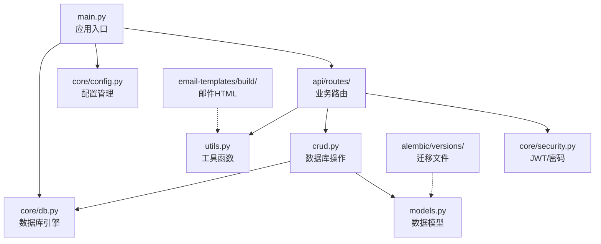

---
# ==========================================
# 系列文章模板 - 用于 Full Stack FastAPI Template
# 使用方法: ./new-chapter.sh "章节标题"
#          .\New-Chapter.ps1 "数字. 章节标题"
# ==========================================

# 标题: 自动从文件名生成，将 "-" 替换为空格并转为标题格式
title: "04 后端根目录backend解析"

# 日期: 自动填充当前时间[reference:6]
date: 2026-06-25T12:07:03+08:00

# 草稿状态: 新文章默认为草稿，防止未完成内容被发布
# draft: true

# 系列名称: 固定值，用于将同一系列的文章关联起来
series: "Full Stack FastAPI Template"

# 章节权重: 控制文章在系列中的显示顺序，数字越小越靠前
# 脚本会自动根据你输入的章节号设置此值
weight: 4

# 章节编号: 便于在文章中引用和显示
chapter: "4"

# 文章描述: 简要介绍本章内容
description: "深入 backend/ 目录，逐层拆解 FastAPI 后端的模块化设计与职责划分和app/ 目录的模块化设计。"

# 封面图片: 建议将图片放在同章节文件夹内，作为页面资源引用
image: "cover.jpg"

# 分类与标签: 用于网站的分类导航
categories: ["project"]
tags: ["FastAPI", "全栈开发", "Python"]

# 其他可选配置
# comments: true   # 是否开启评论
# math: false      # 是否需要数学公式支持
# license: ""      # 文章底部显示自定义许可证信息
# slug: ""         # 自定义URL，若不填则使用文件夹名
# links：[]        # 文章末尾显示外部链接列表
# aliases：[]      # 允许你为该页面设置多个 URL, 定义哪些旧的链接需要跳转到新文章（放置“路标”指向新地址）
# toc: false       # 关闭文章的目录

---

<!--more-->

## 本章导读

<!-- 在这里写下本章的简要介绍和学习目标 -->

上一篇我们翻译并学习了 `backend/README.md`，知道了“如何做”（运行测试、数据库迁移、热重载等），但“代码在哪”和“为什么这样组织”还不清楚。本章我们将正式踏入代码的世界，从 `backend/` 的根目录开始，一路深入到 `app/` 的每个子文件夹，为你建立一幅完整的**后端代码地图**。

> **学习目标**：
> - 理解 `backend/` 根目录下各文件的作用（哪些是核心，哪些是自动生成的）
> - 掌握 `app/` 内部各模块（`api/`、`core/`、`alembic/` 等）的分工
> - 理清 `main.py`、`models.py`、`crud.py`、`api/routes/` 之间的调用关系
> - 了解 `scripts/` 和 `tests/` 在开发流程中的辅助角色

---

## 一、backend/ 根目录全景

首先，我们进入 `backend/` 文件夹，执行 `ls`，看到以下内容：

```bash
backend/
├── app/                    # ⭐ 核心业务代码（重中之重）
├── scripts/                # 辅助脚本（启动、测试）
├── tests/                  # 单元测试与集成测试
├── .venv/                  # Python 虚拟环境（本地开发，自动生成）
├── .mypy_cache/            # mypy 类型检查缓存（自动生成）
├── .ruff_cache/            # ruff 代码检查缓存（自动生成）
├── htmlcov/                # 测试覆盖率报告（运行测试后生成）
├── .dockerignore           # Docker 构建忽略文件
├── .gitignore              # Git 忽略文件
├── alembic.ini             # Alembic 数据库迁移配置
├── Dockerfile              # Docker 镜像构建文件
├── pyproject.toml          # Python 项目配置（uv 依赖管理）
└── README.md               # 后端开发文档（我们已翻译）
```

### 关键文件/目录说明

- **`app/`**：全部业务代码所在地，是后续学习的绝对核心。
- **`scripts/`**：包含 `prestart.sh`（启动前运行迁移）、`test.sh`（运行测试）等，方便运维和 CI。
- **`tests/`**：按 `app/` 的结构组织测试用例（如 `test_api/` 对应测试 API 路由）。
- **`pyproject.toml`**：Python 项目的核心配置文件，声明了所有依赖（由 `uv` 管理）。
- **`alembic.ini`**：Alembic 的配置文件，指向 `app/alembic/` 目录。
- **`.venv/`、`.mypy_cache/`、`.ruff_cache/`、`htmlcov/`**：均为工具自动生成的本地缓存或报告，**不需要手动修改**，在写代码时完全可以忽略它们。

---

## 二、app/ 核心目录概览

进入 `app/` 文件夹，顶层结构和文件如下：

```bash
app/
├── alembic/                  # 数据库迁移版本管理
├── api/                      # ⭐ API 路由层
├── core/                     # ⭐ 核心基础设施（配置、数据库、安全）
├── email-templates/          # 邮件模板（MJML 源码 + 编译后的 HTML）
├── backend_pre_start.py      # 后端启动前检查（等待数据库就绪）
├── crud.py                   # ⭐ 数据库 CRUD 操作
├── initial_data.py           # 初始化数据（首次启动创建超级用户）
├── main.py                   # ⭐ FastAPI 应用入口
├── models.py                 # ⭐ SQLModel 数据模型（表定义）
├── tests_pre_start.py        # 测试环境启动前检查
├── utils.py                  # 通用工具函数（邮件、验证码等）
└── __init__.py               # Python 包标识
```

### 顶层文件职责速览

| 文件 | 核心职责 |
| :--- | :--- |
| `main.py` | 创建 FastAPI 应用实例，加载配置、注册路由、添加中间件 |
| `models.py` | 定义 SQLModel 模型类（映射到 PostgreSQL 表结构） |
| `crud.py` | 封装对数据库的增删改查操作（供 `api/routes/` 调用） |
| `utils.py` | 通用工具函数（发送邮件、生成随机验证码等） |
| `initial_data.py` | 首次启动时，根据 `.env` 中的账号密码创建超级管理员 |
| `backend_pre_start.py` | 在容器启动前反复检测数据库是否可连接，防止应用报错退出 |

---

## 三、子目录逐层拆解

### 1. `api/` —— API 路由层（接口定义）

`api/` 目录结构如下：

```bash
api/
├── routes/                   # 具体业务路由
│   ├── items.py              # 物品的 CRUD 接口
│   ├── login.py              # 登录、刷新 Token、密码重置
│   ├── private.py            # 当前用户信息等私有接口
│   ├── users.py              # 用户注册、列表、更新
│   ├── utils.py              # 健康检查、测试邮件发送
│   └── __init__.py
├── deps.py                   # 依赖注入（如 get_current_user）
├── main.py                   # 路由注册中心（将 routes 挂载到应用）
└── __init__.py
```

**工作流程**：
- `main.py` 负责将 `routes/` 中的各个路由文件注册到 FastAPI 应用，并统一添加 `/api/v1` 等前缀。
- `routes/login.py` 调用 `core/security.py` 进行密码验证和 JWT 生成。
- `routes/users.py`、`routes/items.py` 调用 `crud.py` 执行数据库操作，并使用 `schemas/`（虽未在 `ls` 中显示，但通常与 `models.py` 配合）进行请求/响应验证。

---

### 2. `core/` —— 核心基础设施

```bash
core/
├── config.py                 # Pydantic Settings，从 .env 读取配置
├── db.py                     # SQLModel 数据库引擎
├── security.py               # 密码哈希（bcrypt）与 JWT 处理
└── __init__.py
```

- **`config.py`**：定义了 `Settings` 类，所有 `.env` 中的变量（如 `SECRET_KEY`、`DATABASE_URL`）都被映射为强类型属性。这是整个项目配置的中心。
- **`db.py`**：创建异步/同步数据库引擎，并提供 `get_db()` 依赖函数，供路由获取数据库会话。
- **`security.py`**：提供 `get_password_hash()`、`verify_password()`、`create_access_token()` 等函数，是认证授权的基石。

---

### 3. `alembic/` —— 数据库迁移管理

```bash
alembic/
├── versions/                 # ⭐ 迁移版本文件（按时间戳命名）
│   ├── 1a31ce608336_add_cascade_delete_relationships.py
│   ├── 9c0a54914c78_add_max_length_for_string_varchar_.py
│   ├── d98dd8ec85a3_edit_replace_id_integers_in_all_models_.py
│   ├── e2412789c190_initialize_models.py
│   └── fe56fa70289e_add_created_at_to_user_and_item.py
├── env.py                    # Alembic 环境配置（连接数据库、导入模型）
├── README                    # Alembic 官方说明文件
└── script.py.mako            # 生成新迁移文件的模板
```

- `versions/` 下的每个 `.py` 文件代表一次数据库表结构变更记录。文件名中的哈希和描述性文字清晰记录了变更历史（如“初始化模型”、“添加级联删除”等）。
- `env.py` 是 Alembic 的入口，它会导入 `app/models.py` 中的模型，以便自动检测变更。

---

### 4. `email-templates/` —— 邮件模板（现代化工作流）

```bash
email-templates/
├── build/                    # 编译后的 HTML 邮件
│   ├── new_account.html
│   ├── reset_password.html
│   └── test_email.html
└── src/                      # MJML 源文件（可编辑）
    ├── new_account.mjml
    ├── reset_password.mjml
    └── test_email.mjml
```

- **`src/`**：开发者维护的 `.mjml` 源文件（一种类似 HTML 但更简洁的响应式邮件标记语言）。
- **`build/`**：通过 VS Code 的 MJML 插件一键导出（`MJML: Export to HTML`）生成的 `.html` 文件，供后端 `utils.py` 发送邮件时直接引用。

---

## 四、核心文件之间的调用关系

理解依赖关系是掌握项目架构的关键。下图描述了 `app/` 内部主要模块的协作流程：



**流程说明**：
1. **启动时**：`main.py` 加载 `core/config.py` 中的配置，初始化数据库引擎，并注册 `api/routes/` 中的所有路由。
2. **请求到达时**：
   - 路由函数（如 `login.py`）调用 `core/security.py` 验证密码或生成 Token。
   - 数据操作路由（如 `users.py`）调用 `crud.py` 中的函数，`crud.py` 依赖 `models.py` 和 `core/db.py` 执行 SQL。
   - 发送邮件时，`utils.py` 读取 `email-templates/build/` 中的 HTML 文件并发送。
3. **数据库变更时**：开发者修改 `models.py`，通过 `alembic` 命令在 `alembic/versions/` 生成迁移文件，然后执行 `upgrade` 更新表结构。

---

## 五、scripts/ 和 tests/ 的作用

### `scripts/`（辅助脚本）
- **`prestart.sh`**：在容器启动前由 Docker 执行，自动运行 `alembic upgrade head`（迁移数据库）和 `initial_data.py`（创建超级用户）。
- **`test.sh`**：一键运行所有测试（本地开发使用）。
- **`tests-start.sh`**：在 Docker 容器内部运行测试，会先确保数据库等依赖服务已就绪，再执行 `pytest`。

### `tests/`（测试代码）
- 按照 `app/` 的模块划分组织测试文件（如 `test_api/` 测试接口，`test_crud.py` 测试数据库操作）。
- 使用 `conftest.py` 提供数据库会话、测试客户端等 `fixtures`，实现测试隔离。

---

## 六、总结

本章我们完成了对 `backend/` 目录的全面遍历，画出了完整的代码地图。现在你可以清晰地知道：

- **`main.py`** 是入口，**`core/config.py`** 是配置中心，**`models.py`** 是数据定义的核心。
- **`api/routes/`** 处理 HTTP 请求，依赖 **`crud.py`** 操作数据库，依赖 **`core/security.py`** 处理认证。
- **`alembic/`** 管理数据库版本变更，**`email-templates/`** 采用 MJML 现代化邮件开发流程。

带着这张地图，下一篇我们将打开 `core/config.py`，深入探究这个项目如何优雅地管理配置，又是如何保证类型安全和敏感信息隔离的。

---

