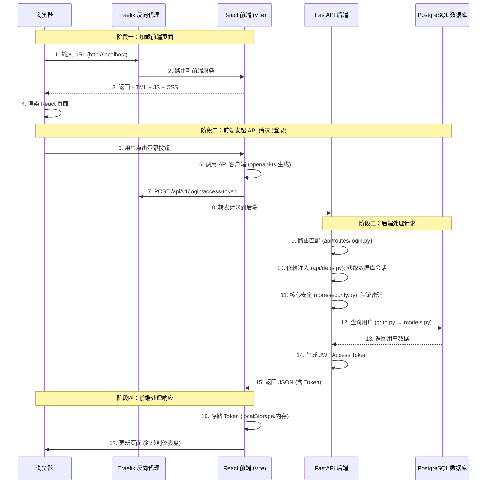

---
# ==========================================
# 系列文章模板 - 用于 Full Stack FastAPI Template
# 使用方法: ./new-chapter.sh "章节标题"
#          .\New-Chapter.ps1 "数字. 章节标题"
# ==========================================

# 标题: 自动从文件名生成，将 "-" 替换为空格并转为标题格式
title: "05 带着地图看代码_全栈架构与核心文件"

# 日期: 自动填充当前时间
date: 2026-06-25T18:01:07+08:00

# 草稿状态: 新文章默认为草稿，防止未完成内容被发布
# draft: true

# 系列名称: 固定值，用于将同一系列的文章关联起来
series: "Full Stack FastAPI Template"

# 章节权重: 控制文章在系列中的显示顺序，数字越小越靠前
# 脚本会自动根据你输入的章节号设置此值
weight: 5

# 章节编号: 便于在文章中引用和显示
chapter: "5"

# 文章描述: 简要介绍本章内容
description: "用三张地图——请求流程图、目录树、JWT令牌流转图，带你带着全局观阅读项目源码"

# 封面图片: 建议将图片放在同章节文件夹内，作为页面资源引用
image: "cover.jpg"

# 分类与标签: 用于网站的分类导航
categories: ["project"]
tags: ["FastAPI", "全栈开发", "Python"]

# 其他可选配置
# comments: true   # 是否开启评论
# math: false      # 是否需要数学公式支持
# license: ""      # 文章底部显示自定义许可证信息
# slug: ""         # 自定义URL，若不填则使用文件夹名
# links：[]        # 文章末尾显示外部链接列表
# aliases：[]      # 允许你为该页面设置多个 URL, 定义哪些旧的链接需要跳转到新文章（放置“路标”指向新地址）
# toc: false       # 关闭文章的目录

---

好的，按照我们之前商定的“三张地图”框架，以下是第五篇博客文章的完整内容。

---


<!--more-->

## 本章导读

前面几章我们把项目的文档和目录结构都过了一遍，但真正翻开代码时，你可能会面临一个困境：**每个文件都看得懂，但连不起来**——看到 `login.py` 知道是登录接口，但不知道它和 `security.py`、`crud.py`、`models.py` 是什么关系；看到 `config.py` 知道是配置，但不知道它在整个启动流程中扮演什么角色。

这就像拿到一张藏宝图碎片，却不知道整张图的全貌。

所以这一章我们不急于深入某个文件的每一行代码，而是先**建立三张全局地图**：

1. **全栈请求流程图**——从浏览器输入 URL 到页面渲染，完整链路是怎样的？
2. **目录树与核心文件标注**——哪些文件必须读，哪些暂时不用管？
3. **JWT 刷新令牌机制**——用最通俗的大白话讲清楚 Token 怎么流转。

拿着这三张地图再去翻代码，看到任何一个函数，你脑子里立刻知道：“哦，这是地图上的那个环节。”

---

## 地图一：全栈请求流程图

> 建议：下图建议放大查看，或在新窗口打开。它描绘了一个完整请求从浏览器到数据库再返回的全链路。



### 拆解一下这个流程

**阶段一：加载前端页面**
- 用户在浏览器输入 `http://localhost`（或自定义域名）。
- Traefik 作为反向代理，将请求路由到前端服务（Vite 开发服务器）。
- 前端返回 HTML、JavaScript、CSS 等静态资源，浏览器渲染出 React 页面。

**阶段二：前端发起 API 请求**
- 用户点击登录按钮，前端调用 API 客户端——这个客户端不是手写的，而是通过 `npm run generate-client` 命令，由 `@hey-api/openapi-ts` 根据后端的 OpenAPI 规范自动生成的。
- 请求经由 Traefik 转发到后端 FastAPI 服务。

**阶段三：后端处理请求**
- FastAPI 根据路由将请求分发到 `api/routes/login.py` 中的 `login_access_token` 函数。
- 该函数通过依赖注入（`api/deps.py`）获取数据库会话。
- 调用 `crud.authenticate()` 验证用户凭证——`crud.py` 使用 `models.py` 中定义的 `User` 模型查询数据库。
- 验证通过后，调用 `core/security.py` 的 `create_access_token()` 生成 JWT。
- 返回 JSON 响应给前端。

**阶段四：前端处理响应**
- 前端收到 Token 后存入本地存储（或内存），并更新页面状态（如跳转到仪表盘）。

> 💡 **关键洞察**：这个项目的核心设计哲学是**前后端完全分离**——前端是一个独立的 React SPA（单页应用），后端是一个独立的 FastAPI API 服务，它们通过 HTTP API 通信，通过 Traefik 统一路由。这种架构的好处是前后端可以独立部署、独立扩展。

---

## 地图二：项目目录树与核心文件标注

> 标注说明：⭐⭐⭐ = 必须精读 | ⭐⭐ = 建议阅读 | ⭐ = 了解即可 | 无标注 = 暂时不用管

```bash
full-stack-fastapi-template/
│
├── backend/                          # ⭐⭐⭐ 后端全部核心代码
│   ├── app/                          # ⭐⭐⭐ 所有业务逻辑
│   │   ├── api/                      # ⭐⭐⭐ API 层
│   │   │   ├── deps.py               # ⭐⭐⭐ 依赖注入（获取当前用户、数据库会话）
│   │   │   ├── main.py               # ⭐⭐ API 路由注册中心
│   │   │   └── routes/               # ⭐⭐⭐ 具体 API 端点
│   │   │       ├── login.py          # ⭐⭐⭐ 登录、Token、密码重置
│   │   │       ├── users.py          # ⭐⭐⭐ 用户 CRUD
│   │   │       ├── items.py          # ⭐⭐⭐ 物品 CRUD
│   │   │       ├── private.py        # ⭐⭐ 当前用户信息
│   │   │       └── utils.py          # ⭐ 工具路由（健康检查等）
│   │   ├── core/                     # ⭐⭐⭐ 核心基础设施
│   │   │   ├── config.py             # ⭐⭐⭐ 配置管理（.env 读取）
│   │   │   ├── db.py                 # ⭐⭐⭐ 数据库引擎
│   │   │   └── security.py           # ⭐⭐⭐ 密码哈希 + JWT
│   │   ├── models.py                 # ⭐⭐⭐ 数据模型（表定义）
│   │   ├── crud.py                   # ⭐⭐⭐ 数据库操作（增删改查）
│   │   ├── main.py                   # ⭐⭐⭐ FastAPI 应用入口
│   │   ├── utils.py                  # ⭐⭐ 工具函数（邮件发送等）
│   │   ├── initial_data.py           # ⭐ 初始化数据（创建超级用户）
│   │   ├── alembic/                  # ⭐ 数据库迁移（versions/）
│   │   └── email-templates/          # ⭐ 邮件模板（MJML）
│   ├── tests/                        # ⭐ 测试代码
│   ├── scripts/                      # ⭐ 辅助脚本
│   ├── pyproject.toml                # ⭐ Python 项目配置
│   └── Dockerfile                    # ⭐ Docker 构建文件
│
├── frontend/                         # 前端代码
│   ├── src/                          # ⭐⭐⭐ React 源码
│   │   ├── client/                   # ⭐⭐⭐ 自动生成的 API 客户端
│   │   ├── routes/                   # ⭐⭐⭐ 前端页面路由 (TanStack Router)
│   │   └── components/               # ⭐⭐ UI 组件 (shadcn/ui)
│   ├── package.json                  # ⭐ 前端依赖配置
│   └── Dockerfile                    # ⭐ 前端 Docker 构建文件
│
├── .env                              # ⭐⭐⭐ 环境变量（SECRET_KEY 等）
├── compose.yml                       # ⭐ Docker 服务编排
└── ... (其他配置、文档文件)
```

### 核心文件的阅读顺序建议

如果你时间有限，建议按以下顺序阅读，每一步都建立在前一步的理解之上：

| 顺序 | 文件 | 读完后你应该明白 |
| :--- | :--- | :--- |
| 1 | `backend/app/core/config.py` | 项目从哪里读取配置？有哪些配置项？ |
| 2 | `backend/app/models.py` | 数据库里有几张表？表之间是什么关系？ |
| 3 | `backend/app/crud.py` | 如何操作数据库？增删改查怎么封装的？ |
| 4 | `backend/app/core/security.py` | 密码怎么加密？JWT 怎么生成？ |
| 5 | `backend/app/api/routes/login.py` | 登录接口完整流程是怎样的？ |
| 6 | `backend/app/main.py` | 应用如何启动？路由和中间件如何注册？ |
| 7 | `frontend/src/client/` | 前端如何调用后端 API？（自动生成的客户端） |

---

## 地图三：JWT 刷新令牌机制（大白话版）

> 官方配置中 `ACCESS_TOKEN_EXPIRE_MINUTES = 60 * 24 * 8`，即 **8 天**。这意味着默认情况下 Access Token 的有效期相当长。

### 核心思想

**用两把钥匙：一把短期用（Access Token），一把长期用（Refresh Token）。**

虽然没有独立的 Refresh Token 端点，但整个认证流程基于以下设计：

### 第一步：登录（获取两把“钥匙”）

1. 用户输入邮箱和密码，前端调用 `POST /api/v1/login/access-token`。
2. 后端验证通过后，生成一个 **Access Token**（有效期 8 天）。
3. 后端将 Access Token 返回给前端。前端将其存储起来（通常存在 `localStorage` 或内存中）。

> 项目默认**未实现独立的 Refresh Token 端点**，而是采用**长有效期 Access Token** 的策略。Access Token 默认 8 天过期，足以覆盖大多数日常使用场景。

### 第二步：日常请求（使用 Access Token）

1. 前端每次调用需要认证的 API 时，在请求头中携带 Access Token：
   ```
   Authorization: Bearer <access_token>
   ```
2. 后端通过 `api/deps.py` 中的依赖注入验证 Token 的有效性。
3. Token 有效 → 处理请求，返回数据。Token 无效或过期 → 返回 `401 Unauthorized`。

### 第三步：Token 过期了怎么办？

当后端返回 `401 Unauthorized` 时：
- 前端需要**引导用户重新登录**，重新走第一步的登录流程，获取新的 Access Token。
- 或者，如果业务需要更长的会话，可以**自行扩展** Refresh Token 机制（例如新增 `/refresh-token` 端点）。

### 密码重置流程（另一种“令牌”机制）

除了登录 Token，项目还实现了**密码重置令牌**：

1. 用户请求密码重置：`POST /api/v1/password-recovery/{email}`。
2. 后端生成一个**一次性密码重置 Token**（有效期 48 小时），通过邮件发送给用户。
3. 用户点击邮件中的链接，携带 Token 访问 `POST /api/v1/reset-password/`。
4. 后端验证 Token 有效性，允许用户设置新密码。

> 💡 **关键区别**：登录用的 Access Token 是**短期凭证**（8 天），而密码重置 Token 是**一次性使用**的，用完即废。

---

## 拿着地图读代码：实战演练

现在让我们用这三张地图，实战演练一个完整的登录请求。

### 第一步：找到入口（地图一 → 阶段三）

打开 `backend/app/api/routes/login.py`，找到 `login_access_token` 函数：

```python
@router.post("/login/access-token")
def login_access_token(
    session: SessionDep,
    form_data: Annotated[OAuth2PasswordRequestForm, Depends()]
) -> Token:
    ...
```

### 第二步：追踪数据流（地图二 → 核心文件）

- `session: SessionDep` 来自 `api/deps.py`——这是数据库会话的依赖注入。
- `form_data` 包含了用户提交的邮箱和密码。

### 第三步：验证用户（地图三 → 认证流程）

```python
user = crud.authenticate(
    session=session,
    email=form_data.username,
    password=form_data.password
)
```

跳转到 `backend/app/crud.py` 的 `authenticate` 函数：
1. 通过 `get_user_by_email` 查询数据库。
2. 调用 `core/security.py` 的 `verify_password` 验证密码。
3. 验证通过后返回用户对象。

### 第四步：生成 Token

```python
access_token_expires = timedelta(minutes=settings.ACCESS_TOKEN_EXPIRE_MINUTES)
return Token(
    access_token=security.create_access_token(
        user.id,
        expires_delta=access_token_expires
    )
)
```

- `settings.ACCESS_TOKEN_EXPIRE_MINUTES` 来自 `core/config.py`。
- `security.create_access_token` 来自 `core/security.py`，使用 `pyjwt` 库生成 JWT。

### 第五步：返回前端

前端收到 `Token` 对象后，存入本地存储，后续请求携带 Token 即可。

---

## 本章总结

三张地图已经全部展开：

| 地图 | 解决的问题 |
| :--- | :--- |
| **全栈请求流程图** | 一个请求从浏览器到数据库再返回，完整链路是什么？ |
| **目录树与核心文件标注** | 这么多文件，哪些必须读？按什么顺序读？ |
| **JWT 令牌流转机制** | Token 怎么生成、怎么验证、过期了怎么办？ |

有了这三张地图，你再翻开任何代码文件，都能立刻定位它在全局中的位置。下一章，我们将正式深入 `core/config.py`，看看这个项目的配置管理是如何做到类型安全又灵活的。

---

