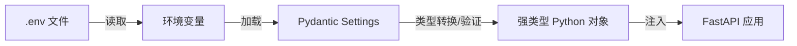
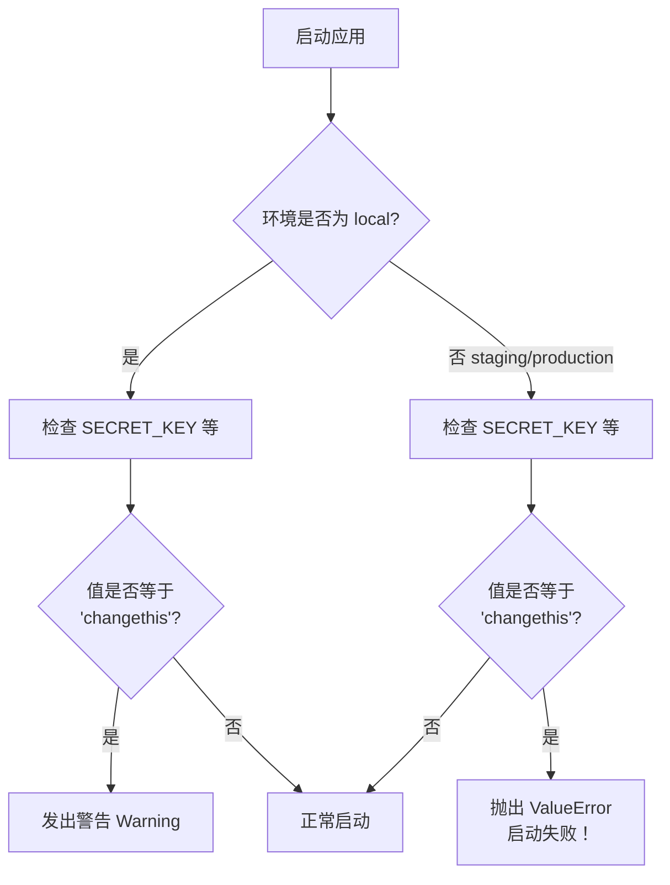

---
# ==========================================
# 系列文章模板 - 用于 Full Stack FastAPI Template
# 使用方法: ./new-chapter.sh "章节标题"
#          .\New-Chapter.ps1 "数字. 章节标题"
# ==========================================

# 标题: 自动从文件名生成，将 "-" 替换为空格并转为标题格式
title: "06 配置管理中心core_config.py 深度解析"

# 日期: 自动填充当前时间
date: 2026-06-25T18:14:46+08:00

# 草稿状态: 新文章默认为草稿，防止未完成内容被发布
# draft: true

# 系列名称: 固定值，用于将同一系列的文章关联起来
series: "Full Stack FastAPI Template"

# 章节权重: 控制文章在系列中的显示顺序，数字越小越靠前
# 脚本会自动根据你输入的章节号设置此值
weight: 6

# 章节编号: 便于在文章中引用和显示
chapter: "6"

# 文章描述: 简要介绍本章内容
description: "深入 core/config.py，拆解 Pydantic Settings 如何管理环境变量、保障类型安全、并强制安全校验"

# 封面图片: 建议将图片放在同章节文件夹内，作为页面资源引用
image: "cover.jpg"

# 分类与标签: 用于网站的分类导航
categories: ["project"]
tags: ["FastAPI", "全栈开发", "Python"]

# 其他可选配置
# comments: true   # 是否开启评论
# math: false      # 是否需要数学公式支持
# license: ""      # 文章底部显示自定义许可证信息
# slug: ""         # 自定义URL，若不填则使用文件夹名
# links：[]        # 文章末尾显示外部链接列表
# aliases：[]      # 允许你为该页面设置多个 URL, 定义哪些旧的链接需要跳转到新文章（放置“路标”指向新地址）
# toc: false       # 关闭文章的目录

---


<!--more-->

## 本章导读

前几章我们有了全局地图，知道了 `core/config.py` 是整个后端配置的“总控室”。但它是怎么工作的？为什么修改 `.env` 就能影响程序行为？`SECRET_KEY` 的校验到底是怎么做的？

这一章，我们就打开 `core/config.py`，一行一行拆解它。你会发现，这个文件虽然不长，却集成了 Pydantic 最精华的配置管理能力——**类型安全、自动验证、环境感知、安全防护**，一应俱全。

---

## 一、配置管理的基本原理

在展开代码之前，先理解一个核心概念：**配置应该与代码分离**。

想象一下：如果你的数据库连接字符串硬编码在代码里，那换一个环境（从开发切换到生产）就得改代码、重新部署，这显然不合理。正确的方式是——**把配置放在环境变量里，代码只负责读取**。

FastAPI 官方推荐的方案是 **Pydantic Settings**。它的工作流程如下：



简单来说：你在 `.env` 里写 `POSTGRES_PORT=5432`（字符串），Pydantic Settings 读到之后，根据类型注解 `POSTGRES_PORT: int` 自动转换成整数。任何地方 `settings.POSTGRES_PORT` 拿到的都是 `int` 类型，无需手动转换，也永远不会出现“把字符串当数字用”的 bug。

---

## 二、config.py 完整源码解读

> 以下源码基于项目最新版本，已做精简标注。

```python
import secrets
import warnings
from typing import Annotated, Any, Literal

from pydantic import (
    AnyUrl,
    BeforeValidator,
    EmailStr,
    HttpUrl,
    PostgresDsn,
    computed_field,
    model_validator,
)
from pydantic_settings import BaseSettings, SettingsConfigDict
from typing_extensions import Self


def parse_cors(v: Any) -> list[str] | str:
    if isinstance(v, str) and not v.startswith("["):
        return [i.strip() for i in v.split(",") if i.strip()]
    elif isinstance(v, list | str):
        return v
    raise ValueError(v)


class Settings(BaseSettings):
    # ========== 1. 模型配置 ==========
    model_config = SettingsConfigDict(
        env_file="../.env",      # 从上一层目录读取 .env
        env_ignore_empty=True,   # 忽略空值
        extra="ignore",          # 忽略未定义的额外字段
    )

    # ========== 2. API 基础配置 ==========
    API_V1_STR: str = "/api/v1"

    # ========== 3. 安全相关 ==========
    SECRET_KEY: str = secrets.token_urlsafe(32)   # 自动生成随机密钥！
    ACCESS_TOKEN_EXPIRE_MINUTES: int = 60 * 24 * 8  # 8天

    # ========== 4. 前端与 CORS ==========
    FRONTEND_HOST: str = "http://localhost:5173"
    ENVIRONMENT: Literal["local", "staging", "production"] = "local"

    BACKEND_CORS_ORIGINS: Annotated[
        list[AnyUrl] | str, BeforeValidator(parse_cors)
    ] = []

    @computed_field
    @property
    def all_cors_origins(self) -> list[str]:
        return [str(origin).rstrip("/") for origin in self.BACKEND_CORS_ORIGINS] + [
            self.FRONTEND_HOST
        ]

    # ========== 5. 项目信息 ==========
    PROJECT_NAME: str

    # ========== 6. Sentry 错误追踪 ==========
    SENTRY_DSN: HttpUrl | None = None

    # ========== 7. PostgreSQL 数据库 ==========
    POSTGRES_SERVER: str
    POSTGRES_PORT: int = 5432
    POSTGRES_USER: str
    POSTGRES_PASSWORD: str = ""
    POSTGRES_DB: str

    @computed_field
    @property
    def SQLALCHEMY_DATABASE_URI(self) -> PostgresDsn:
        return PostgresDsn.build(
            scheme="postgresql+psycopg",
            username=self.POSTGRES_USER,
            password=self.POSTGRES_PASSWORD,
            host=self.POSTGRES_SERVER,
            port=self.POSTGRES_PORT,
            path=self.POSTGRES_DB,
        )

    # ========== 8. 邮件 SMTP 配置 ==========
    SMTP_TLS: bool = True
    SMTP_SSL: bool = False
    SMTP_PORT: int = 587
    SMTP_HOST: str | None = None
    SMTP_USER: str | None = None
    SMTP_PASSWORD: str | None = None
    EMAILS_FROM_EMAIL: EmailStr | None = None
    EMAILS_FROM_NAME: str | None = None

    @model_validator(mode="after")
    def _set_default_emails_from(self) -> Self:
        if not self.EMAILS_FROM_NAME:
            self.EMAILS_FROM_NAME = self.PROJECT_NAME
        return self

    EMAIL_RESET_TOKEN_EXPIRE_HOURS: int = 48

    @computed_field
    @property
    def emails_enabled(self) -> bool:
        return bool(self.SMTP_HOST and self.EMAILS_FROM_EMAIL)

    EMAIL_TEST_USER: EmailStr = "test@example.com"

    # ========== 9. 超级用户 ==========
    FIRST_SUPERUSER: EmailStr
    FIRST_SUPERUSER_PASSWORD: str

    # ========== 10. 安全校验 ==========
    def _check_default_secret(self, var_name: str, value: str | None) -> None:
        if value == "changethis":
            message = (
                f'The value of {var_name} is "changethis", '
                "for security, please change it, at least for deployments."
            )
            if self.ENVIRONMENT == "local":
                warnings.warn(message, stacklevel=1)
            else:
                raise ValueError(message)

    @model_validator(mode="after")
    def _enforce_non_default_secrets(self) -> Self:
        self._check_default_secret("SECRET_KEY", self.SECRET_KEY)
        self._check_default_secret("POSTGRES_PASSWORD", self.POSTGRES_PASSWORD)
        self._check_default_secret(
            "FIRST_SUPERUSER_PASSWORD",
            self.FIRST_SUPERUSER_PASSWORD
        )
        return self


settings = Settings()  # 全局单例
```

---

## 三、逐模块拆解

### 1. 模型配置：从哪里读配置？

```python
model_config = SettingsConfigDict(
    env_file="../.env",      # 从上一层目录读取 .env
    env_ignore_empty=True,   # 忽略空值
    extra="ignore",          # 忽略未定义的额外字段
)
```

**关键点**：
- `env_file="../.env"`：因为 `config.py` 在 `backend/app/core/` 下，所以 `../.env` 指向的是**项目根目录**的 `.env` 文件。
- `extra="ignore"`：如果 `.env` 里有未在 `Settings` 类中定义的变量，直接忽略，不会报错。这增强了兼容性。

### 2. SECRET_KEY：自动生成的安全密钥

```python
SECRET_KEY: str = secrets.token_urlsafe(32)
```

**这是一个非常聪明的设计**。`secrets.token_urlsafe(32)` 会生成一个 **32 字节的随机 URL 安全字符串**。这意味着：
- 即使用户忘记在 `.env` 里配置 `SECRET_KEY`，程序也能正常运行（本地开发）。
- 每个新生成的项目都有**独一无二**的密钥，不会所有项目都用同一个默认值。

> 当然，生产环境还是建议在 `.env` 中显式设置一个固定的 `SECRET_KEY`，否则每次重启容器都会生成新密钥，导致已有 JWT 全部失效。

### 3. ACCESS_TOKEN_EXPIRE_MINUTES：8 天的奥秘

```python
ACCESS_TOKEN_EXPIRE_MINUTES: int = 60 * 24 * 8  # 8天
```

`60 * 24 * 8 = 11520` 分钟。这里直接用数学表达式而非硬编码数字，**可读性极佳**——任何人一看就知道是 8 天。

### 4. CORS 跨域配置：支持多种输入格式

```python
BACKEND_CORS_ORIGINS: Annotated[
    list[AnyUrl] | str, BeforeValidator(parse_cors)
] = []
```

这是一个**带预处理器**的类型注解：
- `BeforeValidator(parse_cors)` 表示在 Pydantic 正式验证之前，先用 `parse_cors` 函数处理原始值。
- `parse_cors` 支持两种输入格式：
  - 逗号分隔的字符串：`"http://localhost,http://localhost:5173"`
  - 已经是列表：`["http://localhost", "http://localhost:5173"]`
- 最终统一转换为 `list[AnyUrl]`。

`all_cors_origins` 是一个计算属性，自动将 `BACKEND_CORS_ORIGINS` 和 `FRONTEND_HOST` 合并，供 `main.py` 中的 CORS 中间件使用。

### 5. 数据库连接：自动构建 DSN

```python
@computed_field
@property
def SQLALCHEMY_DATABASE_URI(self) -> PostgresDsn:
    return PostgresDsn.build(
        scheme="postgresql+psycopg",
        username=self.POSTGRES_USER,
        password=self.POSTGRES_PASSWORD,
        host=self.POSTGRES_SERVER,
        port=self.POSTGRES_PORT,
        path=self.POSTGRES_DB,
    )
```

将数据库连接的各个部分（用户名、密码、主机、端口、数据库名）**自动拼装**成完整的 DSN（数据源名称）。这样你只需要在 `.env` 里分别配置各个字段，不用手动拼接字符串，避免了格式错误。

### 6. 邮件配置：智能默认值与状态判断

```python
@model_validator(mode="after")
def _set_default_emails_from(self) -> Self:
    if not self.EMAILS_FROM_NAME:
        self.EMAILS_FROM_NAME = self.PROJECT_NAME
    return self

@computed_field
@property
def emails_enabled(self) -> bool:
    return bool(self.SMTP_HOST and self.EMAILS_FROM_EMAIL)
```

- **`_set_default_emails_from`**：如果用户没有设置发件人名称，自动使用 `PROJECT_NAME` 作为默认值。
- **`emails_enabled`**：自动判断邮件功能是否可用——只有当 `SMTP_HOST` 和 `EMAILS_FROM_EMAIL` 都有值时，才启用邮件功能。

### 7. 安全校验：强制替换 `changethis`

这是整个配置模块**最重要的安全设计**：

```python
def _check_default_secret(self, var_name: str, value: str | None) -> None:
    if value == "changethis":
        message = f'The value of {var_name} is "changethis", for security, please change it...'
        if self.ENVIRONMENT == "local":
            warnings.warn(message, stacklevel=1)   # 本地环境：只警告
        else:
            raise ValueError(message)              # 非本地环境：直接报错！
```



**为什么这样设计？**

- `.env` 文件中默认的 `SECRET_KEY=changethis` 和 `POSTGRES_PASSWORD=changethis` 等是**极不安全的**。
- 在**本地开发**时，如果忘了改，程序只会发出警告（`warnings.warn`），不影响运行——方便快速上手。
- 在 **staging 或 production** 环境，如果还使用 `changethis`，程序会**直接抛出异常退出**——强制你必须配置安全密钥。

这个设计既**照顾了开发体验**（本地宽容），又**保障了生产安全**（非本地零容忍）。

---

## 四、配置在整个项目中的使用

`config.py` 最后一行创建了一个全局单例：

```python
settings = Settings()
```

其他地方只需要 `from app.core.config import settings` 即可使用。以下是几个典型的使用场景：

### 场景一：main.py 启动应用

```python
from app.core.config import settings

app = FastAPI(
    title=settings.PROJECT_NAME,
    openapi_url=f"{settings.API_V1_STR}/openapi.json",
)

app.add_middleware(
    CORSMiddleware,
    allow_origins=settings.all_cors_origins,  # 使用计算属性
)

app.include_router(api_router, prefix=settings.API_V1_STR)
```


### 场景二：login.py 生成 JWT

```python
from app.core.config import settings

access_token_expires = timedelta(minutes=settings.ACCESS_TOKEN_EXPIRE_MINUTES)
token = create_access_token(user.id, expires_delta=access_token_expires)
```

### 场景三：db.py 连接数据库

```python
from app.core.config import settings

engine = create_engine(str(settings.SQLALCHEMY_DATABASE_URI))
```

---

## 五、总结

| 特性 | 实现方式 | 价值 |
| :--- | :--- | :--- |
| **配置与代码分离** | `env_file="../.env"` | 一套代码，多环境运行 |
| **类型安全** | Pydantic 类型注解 | 自动类型转换，避免运行时错误 |
| **灵活输入** | `BeforeValidator(parse_cors)` | CORS 支持逗号分隔或列表两种格式 |
| **自动拼装** | `@computed_field` | 数据库 DSN、CORS 列表自动生成 |
| **智能默认值** | `secrets.token_urlsafe(32)` | 每个项目自动生成唯一密钥 |
| **环境感知校验** | `_check_default_secret` | 本地警告，生产强制报错 |

`core/config.py` 虽然只有 40 多行代码，却是整个项目的“配置大脑”。它用 Pydantic Settings 的优雅设计，把分散在 `.env` 里的零散字符串，变成了类型安全、自带校验、智能推断的 Python 对象。

下一章，我们将进入 `core/security.py`，看看密码哈希和 JWT 是如何具体实现的。

---

