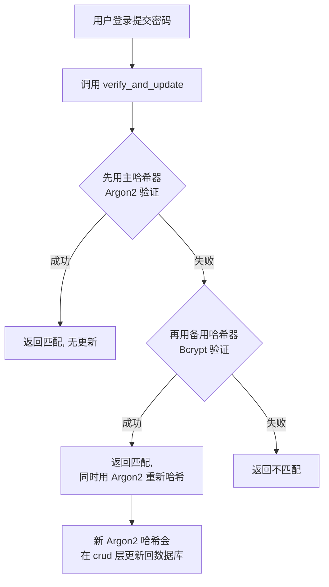
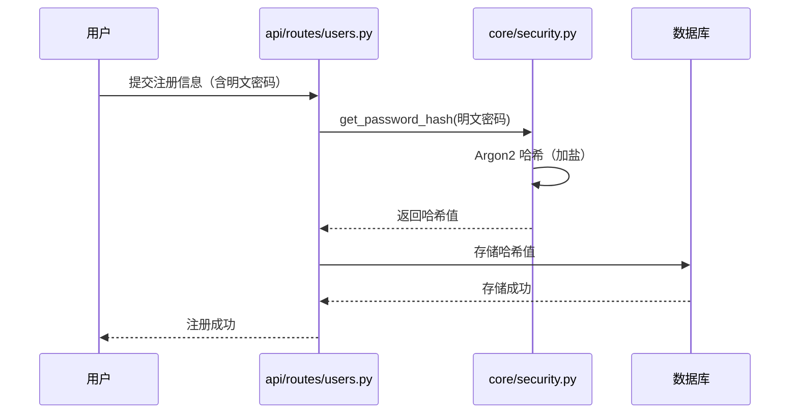
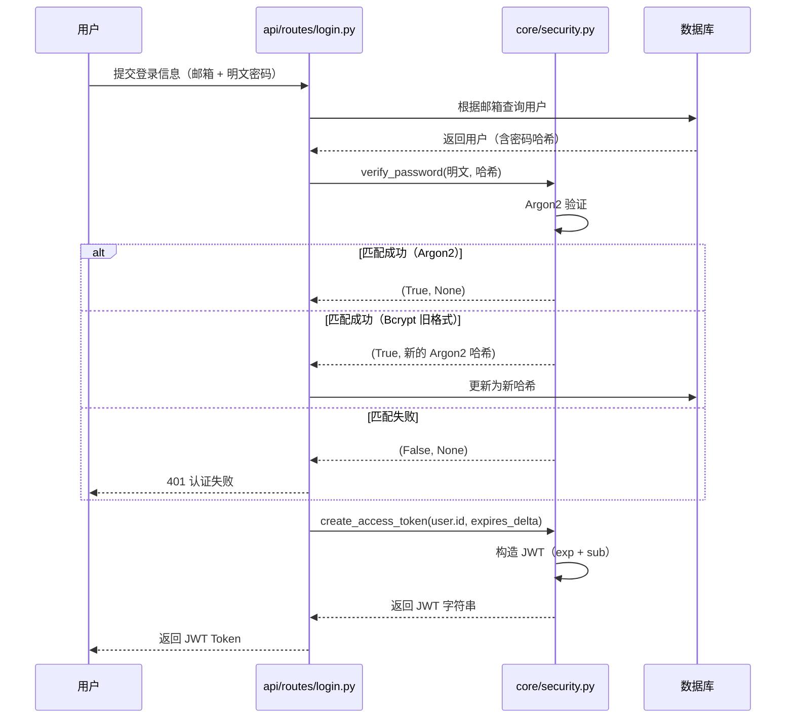

---
# ==========================================
# 系列文章模板 - 用于 Full Stack FastAPI Template
# 使用方法: ./new-chapter.sh "章节标题"
#          .\New-Chapter.ps1 "数字. 章节标题"
# ==========================================

# 标题: 自动从文件名生成，将 "-" 替换为空格并转为标题格式
title: "07 安全核心core/security.py 深度解析"

# 日期: 自动填充当前时间
date: 2026-06-25T18:24:22+08:00

# 草稿状态: 新文章默认为草稿，防止未完成内容被发布
# draft: true

# 系列名称: 固定值，用于将同一系列的文章关联起来
series: "Full Stack FastAPI Template"

# 章节权重: 控制文章在系列中的显示顺序，数字越小越靠前
# 脚本会自动根据你输入的章节号设置此值
weight: 7

# 章节编号: 便于在文章中引用和显示
chapter: "7"

# 文章描述: 简要介绍本章内容
description: "深入 core/security.py，拆解双策略密码哈希（Argon2 + Bcrypt）与 JWT 的生成机制"

# 封面图片: 建议将图片放在同章节文件夹内，作为页面资源引用
image: "cover.jpg"

# 分类与标签: 用于网站的分类导航
categories: ["project"]
tags: ["FastAPI", "全栈开发", "Python"]

# 其他可选配置
# comments: true   # 是否开启评论
# math: false      # 是否需要数学公式支持
# license: ""      # 文章底部显示自定义许可证信息
# slug: ""         # 自定义URL，若不填则使用文件夹名
# links：[]        # 文章末尾显示外部链接列表
# aliases：[]      # 允许你为该页面设置多个 URL, 定义哪些旧的链接需要跳转到新文章（放置“路标”指向新地址）
# toc: false       # 关闭文章的目录

---


<!--more-->

## 本章导读

上一章我们看完了 `core/config.py`，知道了配置从哪来。但配置只是基础，真正的安全核心在 `core/security.py`——**密码怎么加密？JWT 怎么生成？怎么验证？**

这个文件虽然只有 40 多行，却包含了两个至关重要的安全机制：

1. **密码哈希**：使用 `pwdlib` 库，同时支持 Argon2（主）和 Bcrypt（备）两种哈希算法。
2. **JWT（JSON Web Token）**：使用 `python-jose`（即 `jwt`）库，生成访问令牌。

这一章，我们逐行拆解这个文件。

---

## 一、security.py 完整源码

```python
from datetime import datetime, timedelta, timezone
from typing import Any

import jwt
from pwdlib import PasswordHash
from pwdlib.hashers.argon2 import Argon2Hasher
from pwdlib.hashers.bcrypt import BcryptHasher

from app.core.config import settings

# ============================================================
# 第一部分：密码哈希（pwdlib + Argon2/Bcrypt 双策略）
# ============================================================

password_hash = PasswordHash(
    (
        Argon2Hasher(),
        BcryptHasher(),
    )
)

# ============================================================
# 第二部分：JWT 配置与生成
# ============================================================

ALGORITHM = "HS256"


def create_access_token(subject: str | Any, expires_delta: timedelta) -> str:
    expire = datetime.now(timezone.utc) + expires_delta
    to_encode = {"exp": expire, "sub": str(subject)}
    encoded_jwt = jwt.encode(to_encode, settings.SECRET_KEY, algorithm=ALGORITHM)
    return encoded_jwt


def verify_password(plain_password: str, hashed_password: str) -> tuple[bool, str | None]:
    return password_hash.verify_and_update(plain_password, hashed_password)


def get_password_hash(password: str) -> str:
    return password_hash.hash(password)
```

---

## 二、第一部分：密码哈希（双策略设计）

### 2.1 什么是密码哈希？

密码哈希不是加密，而是**单向散列**。它的特点是：
- 同样的密码，每次哈希结果不同（因为有随机盐值）。
- 无法从哈希值反推出原始密码。
- 验证时，把用户输入的密码用同样的算法和盐值重新计算，比对哈希值。

### 2.2 为什么用两种哈希器？

```python
password_hash = PasswordHash(
    (
        Argon2Hasher(),   # 主哈希器（默认用这个）
        BcryptHasher(),   # 备用哈希器（兼容旧密码）
    )
)
```

这是一个**优雅的双策略设计**：

| 角色 | 算法 | 说明 |
| :--- | :--- | :--- |
| **主哈希器** | Argon2 | 当前最安全的密码哈希算法（2022 年密码哈希竞赛冠军） |
| **备用哈希器** | Bcrypt | 老牌可靠算法，用于兼容之前用 Bcrypt 哈希的密码 |

**为什么要这样设计？**

想象一个场景：你的项目上线了一段时间，用的都是 Bcrypt。现在你想升级到更安全的 Argon2。如果直接切换，所有已存在用户的密码哈希无法从 Bcrypt 转到 Argon2。`PasswordHash` 的 `verify_and_update` 方法解决了这个问题：



**这意味着**：
- 新用户注册时，直接用 Argon2 哈希。
- 老用户登录时，先用 Argon2 验证（失败），再用 Bcrypt 验证（成功），然后自动将密码升级为 Argon2 哈希并存入数据库。
- **整个过程对用户完全无感知**，但安全级别悄然提升。

这是一个教科书级别的**向后兼容升级策略**。

### 2.3 两个核心函数

#### `get_password_hash(password: str) -> str`

```python
def get_password_hash(password: str) -> str:
    return password_hash.hash(password)
```

- **作用**：将明文密码转换为哈希值。
- **调用时机**：用户注册、修改密码时。
- **输出示例**：`$argon2id$v=19$m=65536,t=3,p=4$...`（Argon2 格式的字符串）

#### `verify_password(plain_password: str, hashed_password: str) -> tuple[bool, str | None]`

```python
def verify_password(plain_password: str, hashed_password: str) -> tuple[bool, str | None]:
    return password_hash.verify_and_update(plain_password, hashed_password)
```

- **作用**：验证明文密码是否匹配哈希值，**并返回是否需要更新哈希**。
- **返回值**：
  - 第一个值：`bool`，密码是否匹配。
  - 第二个值：`str | None`，如果密码是用 Bcrypt 哈希的（旧格式），返回新的 Argon2 哈希值；否则返回 `None`。
- **调用时机**：用户登录时。

---

## 三、第二部分：JWT 生成

### 3.1 什么是 JWT？

JWT（JSON Web Token）是一个**紧凑的、URL 安全的令牌格式**，由三部分组成：
- **Header（头部）**：声明签名算法（如 HS256）。
- **Payload（载荷）**：存放用户信息（如用户 ID）和过期时间等。
- **Signature（签名）**：使用密钥对前两部分签名，防止篡改。

编码后的 JWT 长这样：
```
eyJhbGciOiJIUzI1NiIsInR5cCI6IkpXVCJ9.eyJleHAiOjE3MTkzMDY5MDAsInN1YiI6IjEifQ.signature
```

### 3.2 配置与生成

#### `ALGORITHM = "HS256"`

- 这是 JWT 的签名算法，**HS256** 表示 HMAC-SHA256（对称签名，用同一个密钥加密和验证）。
- `settings.SECRET_KEY` 就是签名用的密钥。

#### `create_access_token(subject: str | Any, expires_delta: timedelta) -> str`

```python
def create_access_token(subject: str | Any, expires_delta: timedelta) -> str:
    expire = datetime.now(timezone.utc) + expires_delta
    to_encode = {"exp": expire, "sub": str(subject)}
    encoded_jwt = jwt.encode(to_encode, settings.SECRET_KEY, algorithm=ALGORITHM)
    return encoded_jwt
```

**拆解一下**：

| 步骤 | 代码 | 说明 |
| :--- | :--- | :--- |
| 1 | `datetime.now(timezone.utc) + expires_delta` | 计算过期时间（UTC 时间，避免时区问题） |
| 2 | `{"exp": expire, "sub": str(subject)}` | 构造 Payload：`exp` 是过期时间（IETF 标准字段），`sub` 是用户 ID |
| 3 | `jwt.encode(to_encode, settings.SECRET_KEY, algorithm=ALGORITHM)` | 用密钥和算法签名，生成最终的 JWT 字符串 |
| 4 | `return encoded_jwt` | 返回 JWT |

> **注意**：`subject` 通常是用户的 ID，在登录接口中传入的是 `user.id`。

### 3.3 JWT 验证（在哪里？）

你可能注意到，`security.py` 里**没有** `decode` 或 `verify` 函数。那 JWT 在哪里验证？

答案在 **`api/deps.py`** 中：

```python
# api/deps.py（简化版）
from jose import jwt

def get_current_user(session: SessionDep, token: str = Depends(oauth2_scheme)):
    payload = jwt.decode(
        token,
        settings.SECRET_KEY,
        algorithms=[ALGORITHM]  # 就是 "HS256"
    )
    user_id = payload.get("sub")
    user = session.get(User, user_id)
    if not user:
        raise HTTPException(status_code=404, detail="User not found")
    return user
```

`jwt.decode` 做的事情：
1. 验证签名是否有效（用 `SECRET_KEY`）。
2. 检查 `exp` 是否过期。
3. 解析出 `sub` 字段（用户 ID）。
4. 如果签名无效或 Token 过期，抛出异常。

> 💡 **为什么解码在 `deps.py` 而不是 `security.py`？**
>
> 因为解码是**业务层面的依赖注入需求**——它需要查询数据库获取用户对象，所以放在 `api/deps.py` 更合适，`security.py` 只负责纯安全操作（生成 Token、哈希密码）。

---

## 四、完整流程图：注册到登录的全链路

### 4.1 注册流程（密码哈希）



### 4.2 登录流程（密码验证 + JWT 生成）



---

## 五、设计亮点总结

| 设计决策 | 实现方式 | 好处 |
| :--- | :--- | :--- |
| **双哈希策略** | `PasswordHash(Argon2Hasher(), BcryptHasher())` | 新用户用 Argon2，老用户逐步升级，无缝切换 |
| **自动哈希升级** | `verify_and_update` 返回新哈希 | 登录时自动把旧哈希升级为新算法 |
| **JWT 与密码分离** | 验证在 `api/deps.py`，生成在 `security.py` | 职责清晰，`security.py` 专注纯函数逻辑 |
| **UTC 时间** | `datetime.now(timezone.utc)` | 避免时区问题，跨服务器部署不出错 |
| **密钥从配置读** | `settings.SECRET_KEY` | 敏感信息不硬编码，方便多环境管理 |

---

## 六、思考与扩展

### 1. 为什么用 Argon2 而不是 Bcrypt？

Argon2 是 **2022 年密码哈希竞赛的冠军**，相比 Bcrypt 有三个优势：
- **抗 GPU 攻击**：Argon2 需要大量内存，GPU 无法并行加速。
- **可调参数**：可以同时调整时间成本、内存成本、并行度。
- **三种变体**：Argon2d（抗 GPU）、Argon2i（抗侧信道）、Argon2id（混合，**推荐**）。

这个项目默认使用 Argon2id，是当前最安全的选择。

### 2. 为什么 HS256 而不是 RS256？

| 算法 | 类型 | 密钥 | 适用场景 |
| :--- | :--- | :--- | :--- |
| HS256 | 对称 | 单一密钥 | 单服务内部，不需要第三方验证 |
| RS256 | 非对称 | 公钥/私钥对 | 多服务间共享，第三方可验证 |

这个项目是单一后端服务，没有第三方需要验证 Token，所以使用 HS256 就足够了（而且性能更高）。

### 3. 如果我想用 Refresh Token 怎么办？

在 `config.py` 中已经有了 `ACCESS_TOKEN_EXPIRE_MINUTES`，默认 8 天。如果想让 Access Token 更短（比如 15 分钟），用 Refresh Token 来刷新，需要：
1. 在 `security.py` 增加 `create_refresh_token()` 函数。
2. 在 `api/routes/login.py` 同时返回两个 Token。
3. 新增 `api/routes/refresh_token.py` 端点，验证 Refresh Token 并颁发新的 Access Token。

---

## 七、本章总结

| 问题 | 答案 |
| :--- | :--- |
| 密码怎么存的？ | Argon2 哈希 + 盐值，不可逆 |
| 老用户怎么办？ | 登录时自动升级 Bcrypt → Argon2 |
| JWT 怎么生成？ | `jwt.encode` + `SECRET_KEY` + HS256 |
| JWT 怎么验证？ | `jwt.decode` + `SECRET_KEY`，在 `api/deps.py` 里 |
| 为什么这么设计？ | 安全、兼容、职责清晰 |

`core/security.py` 虽短，却集中体现了这个项目的安全设计理念——**默认安全（Secure by Default）、渐进式升级（Graceful Upgrade）、职责分离（Separation of Concerns）**。

下一章，我们将进入 `models.py` 和 `crud.py`，看看数据库表是怎么定义的，数据又是怎么被增删改查的。

---

