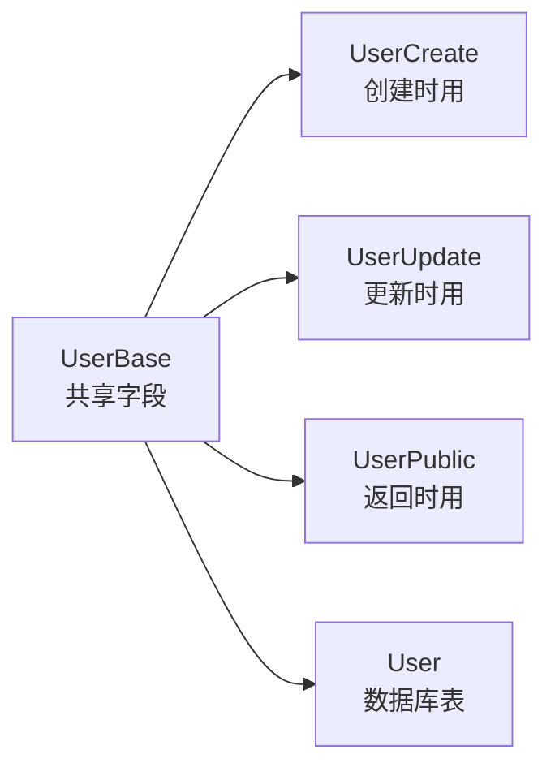
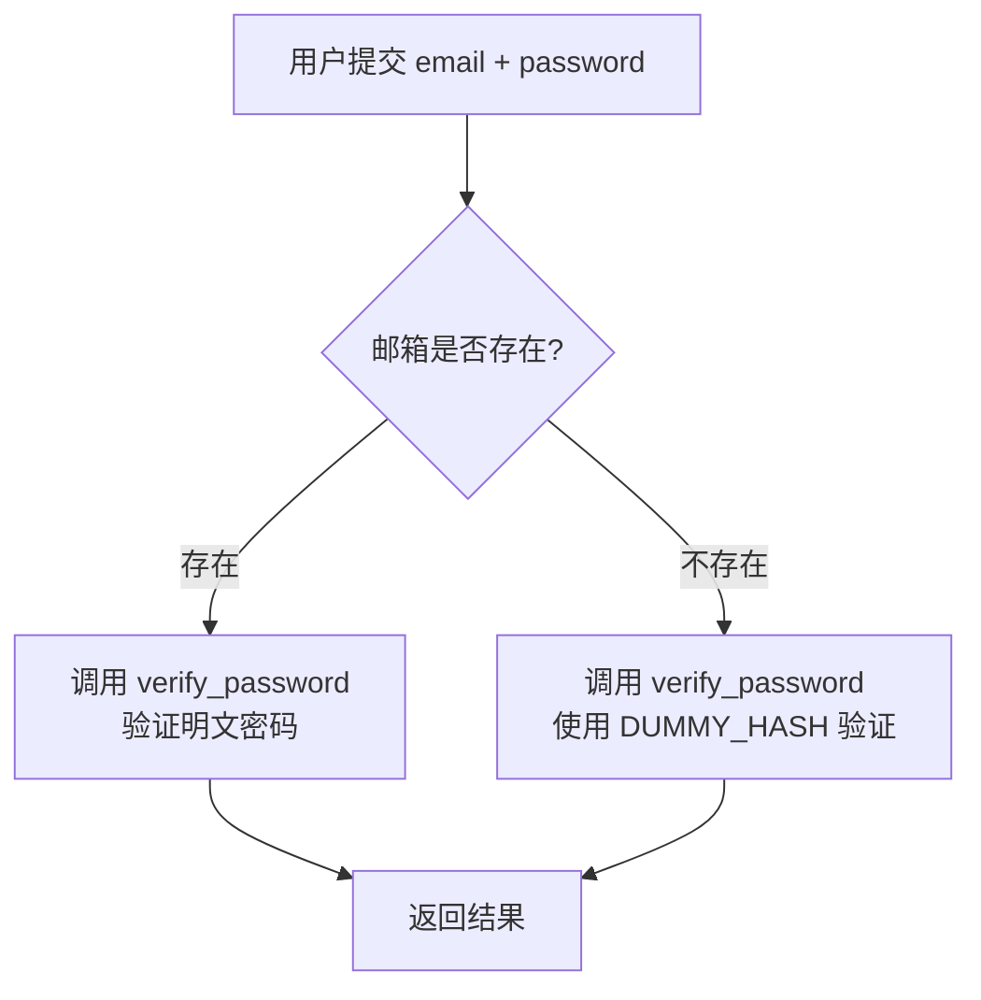
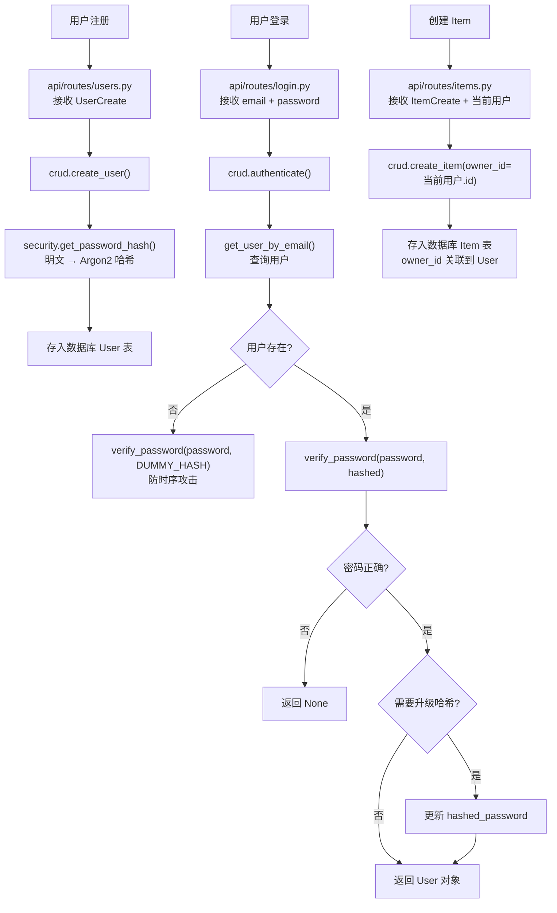

---
# ==========================================
# 系列文章模板 - 用于 Full Stack FastAPI Template
# 使用方法: ./new-chapter.sh "章节标题"
#          .\New-Chapter.ps1 "数字. 章节标题"
# ==========================================

# 标题: 自动从文件名生成，将 "-" 替换为空格并转为标题格式
title: "08 数据模型与CRUD操作models.py_crud.py"

# 日期: 自动填充当前时间
date: 2026-06-25T18:33:51+08:00

# 草稿状态: 新文章默认为草稿，防止未完成内容被发布
# draft: true

# 系列名称: 固定值，用于将同一系列的文章关联起来
series: "Full Stack FastAPI Template"

# 章节权重: 控制文章在系列中的显示顺序，数字越小越靠前
# 脚本会自动根据你输入的章节号设置此值
weight: 8

# 章节编号: 便于在文章中引用和显示
chapter: "8"

# 文章描述: 简要介绍本章内容
description: "深入 models.py 和 crud.py，拆解 SQLModel 表定义、CRUD 操作封装，以及防时序攻击的认证设计"

# 封面图片: 建议将图片放在同章节文件夹内，作为页面资源引用
image: "cover.jpg"

# 分类与标签: 用于网站的分类导航
categories: ["project"]
tags: ["FastAPI", "全栈开发", "Python"]

# 其他可选配置
# comments: true   # 是否开启评论
# math: false      # 是否需要数学公式支持
# license: ""      # 文章底部显示自定义许可证信息
# slug: ""         # 自定义URL，若不填则使用文件夹名
# links：[]        # 文章末尾显示外部链接列表
# aliases：[]      # 允许你为该页面设置多个 URL, 定义哪些旧的链接需要跳转到新文章（放置“路标”指向新地址）
# toc: false       # 关闭文章的目录

---


<!--more-->

## 本章导读

前两章我们看了 `core/config.py`（配置）和 `core/security.py`（安全），现在终于要进入数据层了——**`models.py`** 和 **`crud.py`**。

这两个文件是后端最核心的业务代码：

- **`models.py`**：定义数据库表结构（User、Item），以及 API 请求/响应的数据模型。
- **`crud.py`**：封装对数据库的增删改查操作，是 API 路由和数据库之间的桥梁。

这一章，我们逐行拆解这两个文件，画清楚“数据从 API 到数据库”的完整路径。

---

## 一、models.py：数据模型定义

### 1.1 设计哲学：一个模型，三个角色

这个项目用了 **SQLModel**——一个同时支持 Pydantic（数据验证）和 SQLAlchemy（ORM）的库。它的核心理念是：**同一个类，根据继承方式不同，扮演不同角色**。



| 模型类 | 继承自 | 角色 | 是否映射为表 |
| :--- | :--- | :--- | :--- |
| `UserBase` | `SQLModel` | 共享字段基类 | ❌ 否 |
| `UserCreate` | `UserBase` | 创建用户时的请求体（含密码） | ❌ 否 |
| `UserUpdate` | `UserBase` | 更新用户时的请求体（全可选） | ❌ 否 |
| `UserPublic` | `UserBase` | 返回用户信息时的响应体（无密码） | ❌ 否 |
| **`User`** | `UserBase, table=True` | **数据库表模型** | ✅ **是** |

这种设计的价值在于：**同一组字段（email、is_active、full_name），在不同场景下有不同的“外观”**——创建时需要密码，返回时不能暴露密码，更新时所有字段可选。

### 1.2 User 模型完整拆解

#### 基类：UserBase

```python
class UserBase(SQLModel):
    email: EmailStr = Field(unique=True, index=True, max_length=255)
    is_active: bool = True
    is_superuser: bool = False
    full_name: str | None = Field(default=None, max_length=255)
```

- `EmailStr`：Pydantic 提供的邮箱类型，自动校验邮箱格式。
- `Field(unique=True, index=True)`：数据库层面加唯一约束和索引，保证邮箱不重复且查询高效。
- `is_active`：软删除/禁用用户。
- `is_superuser`：管理员权限标识。

#### 创建模型：UserCreate

```python
class UserCreate(UserBase):
    password: str = Field(min_length=8, max_length=128)
```

- 继承 `UserBase` 的所有字段。
- 新增 `password` 字段，长度限制 8~128 字符。
- **注意**：`UserCreate` 是 API 接收的请求体模型，但最终存入数据库的是 `User.hashed_password`（哈希值），不存明文密码。

#### 数据库表模型：User

```python
class User(UserBase, table=True):
    id: uuid.UUID = Field(default_factory=uuid.uuid4, primary_key=True)
    hashed_password: str
    created_at: datetime | None = Field(
        default_factory=get_datetime_utc,
        sa_type=DateTime(timezone=True),
    )
    items: list["Item"] = Relationship(back_populates="owner", cascade_delete=True)
```

| 字段 | 类型 | 说明 |
| :--- | :--- | :--- |
| `id` | `uuid.UUID` | 主键，自动生成 UUID4 |
| `hashed_password` | `str` | 存储密码哈希值（从 `UserCreate.password` 哈希而来） |
| `created_at` | `datetime` | 创建时间，自动设为 UTC 当前时间 |
| `items` | `list["Item"]` | 关联关系，一个用户有多个 Item，级联删除 |

#### 响应模型：UserPublic

```python
class UserPublic(UserBase):
    id: uuid.UUID
    created_at: datetime | None = None
```

- 继承 `UserBase`，但**不包含 `hashed_password`**。
- 增加 `id` 和 `created_at`，供前端展示。
- 确保**密码哈希永远不会被返回给前端**。

### 1.3 Item 模型（一对多关系）

```python
class Item(ItemBase, table=True):
    id: uuid.UUID = Field(default_factory=uuid.uuid4, primary_key=True)
    created_at: datetime | None = Field(default_factory=get_datetime_utc, sa_type=DateTime(timezone=True))
    owner_id: uuid.UUID = Field(foreign_key="user.id", nullable=False, ondelete="CASCADE")
    owner: User | None = Relationship(back_populates="items")
```

- `owner_id`：外键，指向 `user.id`。
- `ondelete="CASCADE"`：用户删除时，其所有 Item 自动删除。
- `Relationship(back_populates="items")`：与 `User.items` 建立双向关联。

### 1.4 辅助模型

| 模型 | 用途 |
| :--- | :--- |
| `Token` | JWT 响应体：`{"access_token": "...", "token_type": "bearer"}` |
| `TokenPayload` | JWT 载荷结构：`{"sub": "user_id"}` |
| `Message` | 通用消息响应：`{"message": "..."}` |
| `NewPassword` | 重置密码请求体：`{"token": "...", "new_password": "..."}` |

---

## 二、crud.py：数据库操作封装

### 2.1 设计哲学

`crud.py` 是 API 路由和数据库之间的**隔离层**。它的职责是：
- 接收来自 `api/routes/` 的请求数据。
- 调用 `models.py` 中的表模型进行数据库操作。
- 返回处理后的数据给路由。

**好处**：如果将来换数据库或改 ORM，只需要改 `crud.py`，`api/routes/` 完全不受影响。

### 2.2 create_user：创建用户

```python
def create_user(*, session: Session, user_create: UserCreate) -> User:
    db_obj = User.model_validate(
        user_create,
        update={"hashed_password": get_password_hash(user_create.password)}
    )
    session.add(db_obj)
    session.commit()
    session.refresh(db_obj)
    return db_obj
```

**拆解**：

| 步骤 | 代码 | 说明 |
| :--- | :--- | :--- |
| 1 | `User.model_validate(user_create, update={...})` | 用 `UserCreate` 的数据创建 `User` 实例，但把 `password` 替换为哈希值存入 `hashed_password` |
| 2 | `session.add(db_obj)` | 将新用户加入数据库会话 |
| 3 | `session.commit()` | 提交事务，写入数据库 |
| 4 | `session.refresh(db_obj)` | 刷新对象，获取数据库生成的字段（如 `created_at`） |
| 5 | `return db_obj` | 返回新创建的用户对象 |

### 2.3 update_user：更新用户

```python
def update_user(*, session: Session, db_user: User, user_in: UserUpdate) -> Any:
    user_data = user_in.model_dump(exclude_unset=True)
    extra_data = {}
    if "password" in user_data:
        password = user_data["password"]
        hashed_password = get_password_hash(password)
        extra_data["hashed_password"] = hashed_password
    db_user.sqlmodel_update(user_data, update=extra_data)
    session.add(db_user)
    session.commit()
    session.refresh(db_user)
    return db_user
```

**关键点**：
- `model_dump(exclude_unset=True)`：只提取用户**实际传入**的字段（未传的不更新）。
- 如果传入 `password`，自动计算哈希存入 `hashed_password`。
- `sqlmodel_update(user_data, update=extra_data)`：更新 `db_user` 对象，`extra_data` 会覆盖 `user_data` 中的 `password` 字段。

### 2.4 get_user_by_email：查询用户

```python
def get_user_by_email(*, session: Session, email: str) -> User | None:
    statement = select(User).where(User.email == email)
    session_user = session.exec(statement).first()
    return session_user
```

- 使用 SQLAlchemy 风格的 `select()` 构建查询。
- `session.exec(statement).first()` 执行查询并返回第一条结果（或 `None`）。

### 2.5 authenticate：认证（⭐ 重点）

这是 `crud.py` 中最精彩的部分：

```python
# 用于防时序攻击的虚拟哈希
DUMMY_HASH = "$argon2id$v=19$m=65536,t=3,p=4$MjQyZWE1MzBjYjJlZTI0Yw$YTU4NGM5ZTZmYjE2NzZlZjY0ZWY3ZGRkY2U2OWFjNjk"

def authenticate(*, session: Session, email: str, password: str) -> User | None:
    db_user = get_user_by_email(session=session, email=email)
    if not db_user:
        # 防时序攻击：即使邮箱不存在，也执行一次密码验证
        verify_password(password, DUMMY_HASH)
        return None
    verified, updated_password_hash = verify_password(password, db_user.hashed_password)
    if not verified:
        return None
    if updated_password_hash:
        db_user.hashed_password = updated_password_hash
        session.add(db_user)
        session.commit()
        session.refresh(db_user)
    return db_user
```

#### 防时序攻击（Timing Attack）



**什么是时序攻击？**

如果邮箱不存在时直接返回 `None`，而邮箱存在时去验证密码，**两种情况的响应时间不同**。攻击者可以利用这个时间差，逐字猜测哪些邮箱在系统里注册过。

**解决方案**：

```python
if not db_user:
    verify_password(password, DUMMY_HASH)  # 即使没有用户，也执行一次哈希验证
    return None
```

- 无论邮箱是否存在，都执行一次 `verify_password`。
- 两种情况的耗时**完全一致**，攻击者无法通过时间差推断邮箱是否存在。

> `DUMMY_HASH` 是一个预计算的 Argon2 哈希值（随机密码的哈希），用于“假装”验证。它的计算成本与真实用户密码验证相同，从而抹平时间差异。

#### 自动哈希升级

```python
if updated_password_hash:
    db_user.hashed_password = updated_password_hash
    session.add(db_user)
    session.commit()
    session.refresh(db_user)
```

- 如果 `verify_password` 返回了新的哈希值（即用户密码还是用旧算法 Bcrypt 哈希的），自动更新为新哈希。
- 用户无感知，**渐进式升级**到 Argon2。

### 2.6 create_item：创建物品

```python
def create_item(*, session: Session, item_in: ItemCreate, owner_id: uuid.UUID) -> Item:
    db_item = Item.model_validate(item_in, update={"owner_id": owner_id})
    session.add(db_item)
    session.commit()
    session.refresh(db_item)
    return db_item
```

- 与 `create_user` 类似，但多了一个 `owner_id` 参数，将 Item 关联到当前用户。
- `Item.model_validate` 将 `ItemCreate` 的数据映射到 `Item` 表模型。

---

## 三、完整数据流：注册 → 登录 → 创建 Item



---

## 四、设计亮点总结

| 设计决策 | 实现方式 | 好处 |
| :--- | :--- | :--- |
| **单模型多角色** | `UserBase` + `UserCreate`/`UserUpdate`/`UserPublic`/`User` | 不同场景使用不同模型，各司其职 |
| **密码从不返回** | `UserPublic` 不包含 `hashed_password` | 防止密码哈希泄露 |
| **防时序攻击** | 邮箱不存在时仍执行 `verify_password(DUMMY_HASH)` | 防止攻击者探测邮箱注册情况 |
| **自动哈希升级** | 登录时检测 `verify_password` 返回的新哈希 | 老用户密码无缝升级到 Argon2 |
| **CRUD 作为隔离层** | 路由不直接操作 `session` | 便于测试和未来重构 |
| **级联删除** | `ondelete="CASCADE"` | 用户删除时自动清理关联数据 |

---

## 五、思考与扩展

### 1. 为什么用 UUID 而不是自增 ID？

| 方案 | 优点 | 缺点 |
| :--- | :--- | :--- |
| **自增 ID** | 简单、有序、节省空间 | 暴露记录数量，容易被遍历 |
| **UUID** | 无法遍历，安全性更高 | 占用空间大，索引性能略低 |

这个项目选择了 UUID，在安全性（无法猜测下一个用户 ID）和扩展性（分布式生成 ID）上更有优势。

### 2. DUMMY_HASH 的值是固定的，没问题吗？

`DUMMY_HASH` 是一个固定字符串，用于**模拟计算耗时**，而不是实际验证。它的唯一要求是：
- 是一个合法的 Argon2 哈希格式。
- 计算成本与真实密码验证**大致相同**。

即使用户知道这个哈希值，也无法从中反推出任何信息，因为它是“假”的，不代表任何真实用户。

### 3. 为什么 `UserUpdate` 的 `email` 用 `Field(default=None)`？

```python
class UserUpdate(UserBase):
    email: EmailStr | None = Field(default=None, max_length=255)
```

因为 `UserBase` 中的 `email` 是必填的（没有 `default=None`），但在更新场景中，用户可能**只想更新密码而不想改邮箱**，所以必须重写为可选字段。

---

## 六、本章总结

| 文件 | 核心职责 |
| :--- | :--- |
| **`models.py`** | 定义数据库表结构（User、Item）和 API 请求/响应模型 |
| **`crud.py`** | 封装 CRUD 操作，作为路由和数据库之间的隔离层 |
| **`authenticate`** | 防时序攻击 + 自动哈希升级，安全设计典范 |

现在你知道了：
- 一个 `User` 在数据库里存了什么（`id`、`email`、`hashed_password`、`created_at`）
- 密码从明文到哈希的流转路径（`UserCreate.password` → `security.get_password_hash()` → `User.hashed_password`）
- 登录时如何兼顾安全（防时序攻击）和升级（自动哈希升级）
- Item 和 User 如何通过 `owner_id` 建立一对多关系

下一章，我们将补上 `core/db.py`，看看数据库连接是怎么建立的，`init_db` 又是怎么创建超级用户的。

---

