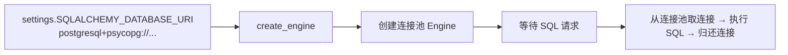
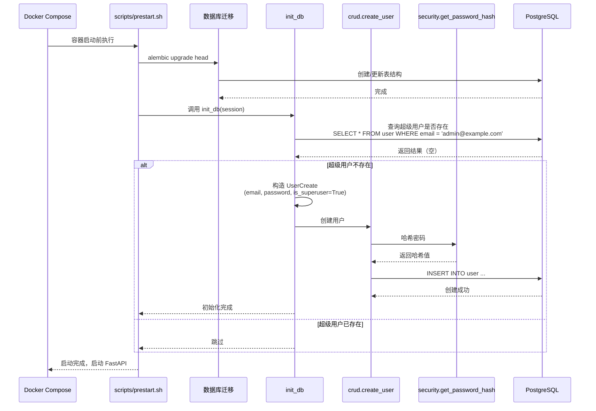
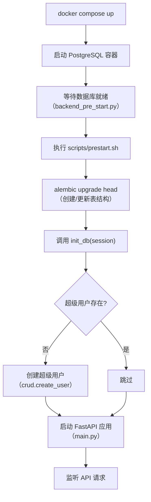
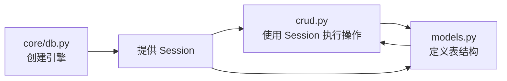

---
# ==========================================
# 系列文章模板 - 用于 Full Stack FastAPI Template
# 使用方法: ./new-chapter.sh "章节标题"
#          .\New-Chapter.ps1 "数字. 章节标题"
# ==========================================

# 标题: 自动从文件名生成，将 "-" 替换为空格并转为标题格式
title: "09 数据库引擎与初始化core_db.py"

# 日期: 自动填充当前时间
date: 2026-06-25T18:41:46+08:00

# 草稿状态: 新文章默认为草稿，防止未完成内容被发布
# draft: true

# 系列名称: 固定值，用于将同一系列的文章关联起来
series: "Full Stack FastAPI Template"

# 章节权重: 控制文章在系列中的显示顺序，数字越小越靠前
# 脚本会自动根据你输入的章节号设置此值
weight: 9

# 章节编号: 便于在文章中引用和显示
chapter: "9"

# 文章描述: 简要介绍本章内容
description: "深入 core/db.py，拆解 SQLModel 数据库引擎创建、init_db 初始化逻辑，以及超级用户的自动创建机制"

# 封面图片: 建议将图片放在同章节文件夹内，作为页面资源引用
image: "cover.jpg"

# 分类与标签: 用于网站的分类导航
categories: ["project"]
tags: ["FastAPI", "全栈开发", "Python"]

# 其他可选配置
# comments: true   # 是否开启评论
# math: false      # 是否需要数学公式支持
# license: ""      # 文章底部显示自定义许可证信息
# slug: ""         # 自定义URL，若不填则使用文件夹名
# links：[]        # 文章末尾显示外部链接列表
# aliases：[]      # 允许你为该页面设置多个 URL, 定义哪些旧的链接需要跳转到新文章（放置“路标”指向新地址）
# toc: false       # 关闭文章的目录

---


<!--more-->

## 本章导读

前两篇我们看了 `models.py`（表结构）和 `crud.py`（数据操作），但还缺一个关键问题：**数据库连接从哪来？应用启动时怎么初始化数据？**

`core/db.py` 就是答案。它虽然只有 30 行，却负责两件大事：

1. **数据库引擎**：使用 `create_engine` 创建连接池。
2. **数据库初始化**：`init_db()` 在应用启动时创建超级用户（如果不存在）。

这一章，我们逐行拆解 `db.py`，并画出完整的数据库启动流程。

---

## 一、db.py 完整源码

```python
from sqlmodel import Session, create_engine, select

from app import crud
from app.core.config import settings
from app.models import User, UserCreate

# ============================================================
# 第一部分：创建数据库引擎
# ============================================================

engine = create_engine(str(settings.SQLALCHEMY_DATABASE_URI))


# ============================================================
# 第二部分：数据库初始化
# ============================================================

def init_db(session: Session) -> None:
    # 注意：表结构应该通过 Alembic 迁移创建
    # 如果不想用迁移，取消下面这行注释
    # SQLModel.metadata.create_all(engine)

    # 检查超级用户是否已存在
    user = session.exec(
        select(User).where(User.email == settings.FIRST_SUPERUSER)
    ).first()

    # 如果不存在，创建超级用户
    if not user:
        user_in = UserCreate(
            email=settings.FIRST_SUPERUSER,
            password=settings.FIRST_SUPERUSER_PASSWORD,
            is_superuser=True,
        )
        user = crud.create_user(session=session, user_create=user_in)
```

---

## 二、第一部分：数据库引擎

### 2.1 create_engine：创建连接池

```python
engine = create_engine(str(settings.SQLALCHEMY_DATABASE_URI))
```

`create_engine` 是 SQLAlchemy/SQLModel 的核心函数，它做的事情：



**参数说明**：

`settings.SQLALCHEMY_DATABASE_URI` 是在 `core/config.py` 中通过 `@computed_field` 自动构建的：

```python
# core/config.py
@computed_field
@property
def SQLALCHEMY_DATABASE_URI(self) -> PostgresDsn:
    return PostgresDsn.build(
        scheme="postgresql+psycopg",
        username=self.POSTGRES_USER,
        password=self.POSTGRES_PASSWORD,
        host=self.POSTGRES_SERVER,
        port=self.POSTGRES_PORT,
        path=self.POSTGRES_DB,
    )
```

所以 `str(settings.SQLALCHEMY_DATABASE_URI)` 最终会变成类似：

```
postgresql+psycopg://postgres:changethis@db:5432/app
```

> **注意**：`engine` 是一个**全局单例**，在模块加载时创建，整个应用生命周期内复用同一个连接池。

### 2.2 引擎的懒加载特性

`create_engine` 并不会立即创建数据库连接。它只是配置了一个连接池，**真正连接到数据库的时机是第一次执行 SQL 时**（比如第一次 `session.exec(select(...))`）。

这有一个好处：如果数据库暂时不可用（比如容器还没启动完成），应用不会在启动阶段就崩溃，而是在第一次查询时才报错。

---

## 三、第二部分：数据库初始化（init_db）

### 3.1 init_db 的调用时机

`init_db` 不是自动调用的，它需要在**应用启动前**手动调用。项目中的调用位置在 `scripts/prestart.sh`：

```bash
# scripts/prestart.sh（简化）
#!/bin/bash

# 运行数据库迁移
alembic upgrade head

# 初始化数据（创建超级用户）
python -c "
from app.core.db import init_db
from app.core.config import settings
from sqlmodel import Session, create_engine

engine = create_engine(str(settings.SQLALCHEMY_DATABASE_URI))
with Session(engine) as session:
    init_db(session)
"
```

### 3.2 工作流程图



### 3.3 init_db 逐行解析

```python
def init_db(session: Session) -> None:
    # 检查超级用户是否已存在
    user = session.exec(
        select(User).where(User.email == settings.FIRST_SUPERUSER)
    ).first()

    if not user:
        user_in = UserCreate(
            email=settings.FIRST_SUPERUSER,
            password=settings.FIRST_SUPERUSER_PASSWORD,
            is_superuser=True,
        )
        user = crud.create_user(session=session, user_create=user_in)
```

| 步骤 | 代码 | 说明 |
| :--- | :--- | :--- |
| 1 | `select(User).where(User.email == settings.FIRST_SUPERUSER)` | 查询超级用户邮箱是否已存在 |
| 2 | `.first()` | 取第一条结果（邮箱是唯一的，所以最多一条） |
| 3 | `if not user:` | 如果不存在 |
| 4 | `UserCreate(email=..., password=..., is_superuser=True)` | 构造用户创建对象，`is_superuser=True` 赋予管理员权限 |
| 5 | `crud.create_user(session=session, user_create=user_in)` | 调用 `crud.py` 中的 `create_user` 写入数据库 |

### 3.4 为什么用 Alembic 迁移而不是 `create_all`？

文件中有这样一段注释：

```python
# Tables should be created with Alembic migrations
# But if you don't want to use migrations, create
# the tables un-commenting the next lines
# from sqlmodel import SQLModel
# SQLModel.metadata.create_all(engine)
```

| 方式 | 优点 | 缺点 |
| :--- | :--- | :--- |
| **Alembic 迁移** | 版本可控、可回滚、生产环境标准 | 需要手动生成迁移文件 |
| **`create_all`** | 自动创建，方便开发 | 无法追踪变更，生产环境风险大 |

项目**推荐使用 Alembic**，因为生产环境必须用迁移管理数据库变更。但为了方便开发，也保留了 `create_all` 的注释，你可以在开发时取消注释快速建表。

---

## 四、完整的数据库启动流程

把前几篇的内容串起来，完整的数据库启动流程如下：



---

## 五、设计要点与思考

### 5.1 引擎作为全局单例

```python
engine = create_engine(str(settings.SQLALCHEMY_DATABASE_URI))
```

**为什么是全局变量？**

- 连接池是线程安全的，可以多线程共享。
- 避免每次请求都创建新引擎（开销巨大）。
- FastAPI 应用生命周期内复用同一个引擎。

**潜在问题**：在测试环境中，如果多个测试文件独立运行，`engine` 是全局的，可能会被多次创建。项目通过 `tests/conftest.py` 中的 fixture 来处理测试数据库隔离。

### 5.2 init_db 的幂等性

```python
user = session.exec(select(User).where(User.email == settings.FIRST_SUPERUSER)).first()
if not user:
    # 创建超级用户
```

`init_db` 是**幂等**的——无论执行多少次，结果都一样（超级用户只创建一次）。这很重要，因为：
- `prestart.sh` 每次容器启动都会执行。
- 如果超级用户已存在，不会重复创建或报错。

### 5.3 为什么超级用户用环境变量配置？

```python
settings.FIRST_SUPERUSER          # 从 .env 读取
settings.FIRST_SUPERUSER_PASSWORD # 从 .env 读取
```

**好处**：
- 不同环境（开发、测试、生产）可以用不同的超级用户账号。
- 密码不硬编码在代码里，通过 `.env` 管理。
- 生产环境可以通过 Kubernetes Secret 或 CI/CD 变量注入，更加安全。

---

## 六、与前面几篇的关系

现在，数据层的三篇已经完整：

| 篇目 | 文件 | 解决的核心问题 |
| :--- | :--- | :--- |
| **第八篇（上）** | `models.py` | 表结构长什么样？ |
| **第八篇（下）** | `crud.py` | 数据怎么操作？ |
| **第九篇** | `core/db.py` | 连接从哪来？怎么初始化？ |

三者的关系：



- `db.py` 创建 `engine`，提供 `Session`。
- `crud.py` 使用 `Session` 执行数据库操作。
- `models.py` 定义表模型，被 `crud.py` 和 `db.py` 共同依赖。

---

## 七、本章总结

| 组件 | 职责 |
| :--- | :--- |
| `engine` | 数据库连接池，全局单例 |
| `settings.SQLALCHEMY_DATABASE_URI` | 从环境变量自动构建的连接字符串 |
| `init_db()` | 幂等创建超级用户 |
| `prestart.sh` | 启动前执行迁移 + 初始化数据 |

现在，数据层的拼图已经完整：

- 你知道了**连接怎么来**（`db.py` 创建引擎）。
- 你知道了**表长什么样**（`models.py` 定义）。
- 你知道了**数据怎么操作**（`crud.py` 封装）。
- 你知道了**初始数据从哪来**（`init_db` + `prestart.sh`）。

下一章，我们将进入 `api/routes/`，看看用户注册、登录、创建物品这几个核心 API 是怎么串联起来的。

---

