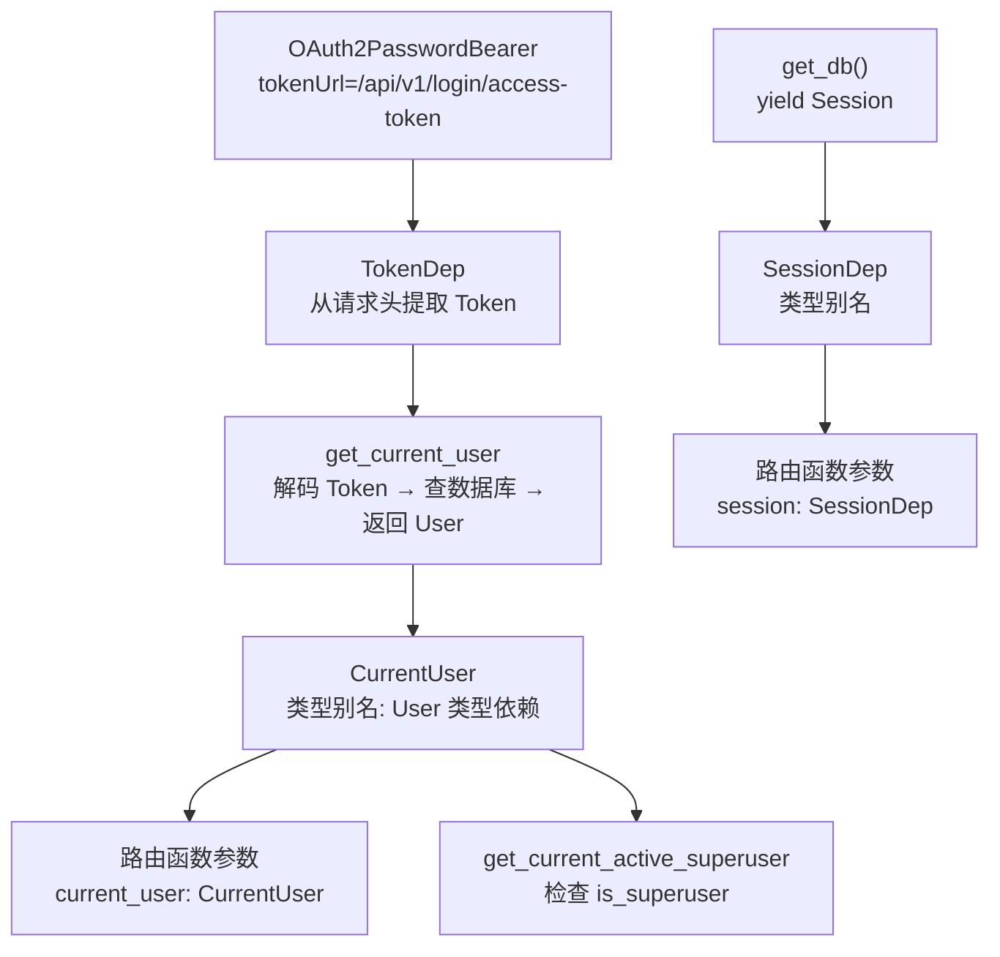
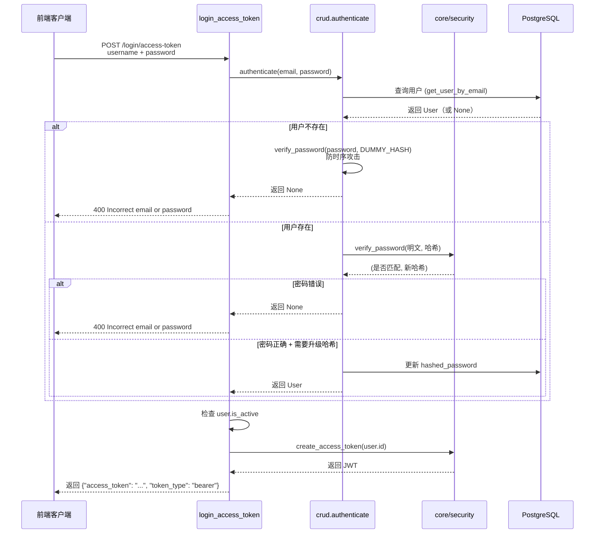

---
# ==========================================
# 系列文章模板 - 用于 Full Stack FastAPI Template
# 使用方法: ./new-chapter.sh "章节标题"
#          .\New-Chapter.ps1 "数字. 章节标题"
# ==========================================

# 标题: 自动从文件名生成，将 "-" 替换为空格并转为标题格式
title: "10 API层全解析_deps_main_routes"

# 日期: 自动填充当前时间
date: 2026-06-26T12:30:38+08:00

# 草稿状态: 新文章默认为草稿，防止未完成内容被发布
# draft: true

# 系列名称: 固定值，用于将同一系列的文章关联起来
series: "Full Stack FastAPI Template"

# 章节权重: 控制文章在系列中的显示顺序，数字越小越靠前
# 脚本会自动根据你输入的章节号设置此值
weight: 10

# 章节编号: 便于在文章中引用和显示
chapter: "10"

# 文章描述: 简要介绍本章内容
description: "深入 api/ 层，拆解依赖注入（deps.py）、路由注册（main.py）以及 login、users、items 等核心接口的实现"

# 封面图片: 建议将图片放在同章节文件夹内，作为页面资源引用
image: "cover.jpg"

# 分类与标签: 用于网站的分类导航
categories: ["project"]
tags: ["FastAPI", "全栈开发", "Python"]

# 其他可选配置
# comments: true   # 是否开启评论
# math: false      # 是否需要数学公式支持
# license: ""      # 文章底部显示自定义许可证信息
# slug: ""         # 自定义URL，若不填则使用文件夹名
# links：[]        # 文章末尾显示外部链接列表
# aliases：[]      # 允许你为该页面设置多个 URL, 定义哪些旧的链接需要跳转到新文章（放置“路标”指向新地址）
# toc: false       # 关闭文章的目录

---


<!--more-->

## 本章导读

在开始之前，先回答一个你可能已经在想的问题：**为什么这一篇要一次性讲完整个 api/ 层，而不是像之前那样一个文件一篇？**

回想一下我们之前的学习节奏：

- `core/config.py`：引入了 **Pydantic Settings** 的新概念。
- `core/security.py`：引入了 **Argon2 哈希** 和 **JWT 编解码** 的新概念。
- `models.py`：引入了 **SQLModel 表定义** 和 **单模型多角色** 的设计模式。
- `crud.py`：引入了 **防时序攻击** 和 **自动哈希升级** 的实战技巧。
- `core/db.py`：引入了 **数据库引擎** 和 **连接池** 的新概念。

每一篇都在**引入新的概念**，每一个文件都在**解决一个独立的问题**。所以我把它们拆开，让你有空间消化。

但 `api/` 层不同。

`api/` 层的本质是 **“组装”**——它没有引入新的概念，而是把我们已经学过的所有积木（`core/security.py`、`core/db.py`、`models.py`、`crud.py`、`utils.py`）**组合成可用的 API 接口**。它展示的是 **“这些积木如何一起工作”**。

如果把 `api/` 层再拆成 5 篇（`deps.py` 一篇、`login.py` 一篇、`users.py` 一篇、`items.py` 一篇、`private+utils` 一篇），每一篇都在做同样的事情：**路由函数 + 调用 crud + 返回模型**。三篇看下来，读者会经历“连续看路由函数”的审美疲劳，反而会模糊重点。

所以这一篇，我选择 **一次性走完 api/ 层的全貌**，让你立刻看到“原来所有积木合起来是这样工作的”，形成完整的认知闭环。

---

## 一、api/ 目录全景

```
api/
├── deps.py          # ⭐ 依赖注入（数据库会话、当前用户）
├── main.py          # ⭐ 路由注册中心
└── routes/
    ├── login.py     # ⭐⭐⭐ 登录、Token、密码重置
    ├── users.py     # ⭐⭐⭐ 用户注册、查询、更新、删除
    ├── items.py     # ⭐⭐⭐ 物品 CRUD（含权限控制）
    ├── private.py   # ⭐ 私有 API（仅本地环境）
    └── utils.py     # ⭐ 工具 API（健康检查、测试邮件）
```

`deps.py` 是“后勤部”，`routes/` 是“业务前线”，`main.py` 是“调度中心”。下面逐一展开。

---

## 二、deps.py：依赖注入的核心

`deps.py` 提供了路由函数需要的所有依赖——数据库会话、Token 提取、当前用户认证。

### 2.1 完整源码

```python
from collections.abc import Generator
from typing import Annotated

import jwt
from fastapi import Depends, HTTPException, status
from fastapi.security import OAuth2PasswordBearer
from jwt.exceptions import InvalidTokenError
from pydantic import ValidationError
from sqlmodel import Session

from app.core import security
from app.core.config import settings
from app.core.db import engine
from app.models import TokenPayload, User

# ============================================================
# 1. OAuth2 密码流配置
# ============================================================

reusable_oauth2 = OAuth2PasswordBearer(
    tokenUrl=f"{settings.API_V1_STR}/login/access-token"
)

# ============================================================
# 2. 数据库会话依赖
# ============================================================

def get_db() -> Generator[Session, None, None]:
    with Session(engine) as session:
        yield session

SessionDep = Annotated[Session, Depends(get_db)]

# ============================================================
# 3. Token 依赖
# ============================================================

TokenDep = Annotated[str, Depends(reusable_oauth2)]

# ============================================================
# 4. 获取当前用户
# ============================================================

def get_current_user(session: SessionDep, token: TokenDep) -> User:
    try:
        payload = jwt.decode(
            token, settings.SECRET_KEY, algorithms=[security.ALGORITHM]
        )
        token_data = TokenPayload(**payload)
    except (InvalidTokenError, ValidationError):
        raise HTTPException(
            status_code=status.HTTP_403_FORBIDDEN,
            detail="Could not validate credentials",
        )
    user = session.get(User, token_data.sub)
    if not user:
        raise HTTPException(status_code=404, detail="User not found")
    if not user.is_active:
        raise HTTPException(status_code=400, detail="Inactive user")
    return user

CurrentUser = Annotated[User, Depends(get_current_user)]

# ============================================================
# 5. 获取当前超级用户
# ============================================================

def get_current_active_superuser(current_user: CurrentUser) -> User:
    if not current_user.is_superuser:
        raise HTTPException(
            status_code=403, detail="The user doesn't have enough privileges"
        )
    return current_user
```

### 2.2 依赖链路图



### 2.3 逐层拆解

#### reusable_oauth2：OAuth2 密码流

```python
reusable_oauth2 = OAuth2PasswordBearer(
    tokenUrl=f"{settings.API_V1_STR}/login/access-token"
)
```

- FastAPI 提供的 OAuth2 认证方案。
- `tokenUrl` 告诉 FastAPI：去哪里获取 Token（即登录接口）。
- 当路由中使用了 `Depends(reusable_oauth2)`，FastAPI 会自动从请求头中提取 `Authorization: Bearer <token>`。

#### get_db：数据库会话生成器

```python
def get_db() -> Generator[Session, None, None]:
    with Session(engine) as session:
        yield session
```

- 使用 `yield` 创建一个**生成器**，每次请求产生一个数据库会话。
- `with Session(engine)` 确保会话在请求结束后自动关闭。
- `SessionDep = Annotated[Session, Depends(get_db)]` 创建类型别名，路由函数写 `session: SessionDep` 即可。

#### get_current_user：JWT 验证 + 用户查询

```python
def get_current_user(session: SessionDep, token: TokenDep) -> User:
    try:
        payload = jwt.decode(
            token, settings.SECRET_KEY, algorithms=[security.ALGORITHM]
        )
        token_data = TokenPayload(**payload)
    except (InvalidTokenError, ValidationError):
        raise HTTPException(status_code=403, detail="Could not validate credentials")

    user = session.get(User, token_data.sub)
    if not user:
        raise HTTPException(status_code=404, detail="User not found")
    if not user.is_active:
        raise HTTPException(status_code=400, detail="Inactive user")
    return user
```

| 步骤 | 操作 | 失败响应 |
| :--- | :--- | :--- |
| 1 | `jwt.decode` 验证签名和过期时间 | 403 Forbidden |
| 2 | `TokenPayload(**payload)` 解析载荷 | 403 Forbidden |
| 3 | `session.get(User, sub)` 查用户 | 404 Not Found |
| 4 | 检查 `user.is_active` | 400 Bad Request |
| 5 | 返回 `User` 对象 | — |

#### CurrentUser 和 get_current_active_superuser

```python
CurrentUser = Annotated[User, Depends(get_current_user)]

def get_current_active_superuser(current_user: CurrentUser) -> User:
    if not current_user.is_superuser:
        raise HTTPException(status_code=403, detail="...")
    return current_user
```

- `CurrentUser` 是类型别名，表示“经过认证的当前用户”。
- `get_current_active_superuser` 额外检查 `is_superuser`。
- 普通接口用 `CurrentUser`，管理员接口用 `get_current_active_superuser`。

---

## 三、main.py：路由注册中心

```python
from fastapi import APIRouter
from app.api.routes import items, login, private, users, utils
from app.core.config import settings

api_router = APIRouter()
api_router.include_router(login.router)
api_router.include_router(users.router)
api_router.include_router(utils.router)
api_router.include_router(items.router)

if settings.ENVIRONMENT == "local":
    api_router.include_router(private.router)
```

- 创建根路由 `api_router`，通过 `include_router` 挂载所有子路由。
- `private.router` 只在 `ENVIRONMENT == "local"` 时加载——环境感知设计。

这个 `api_router` 最终在 `app/main.py` 中挂载到 FastAPI 应用：

```python
app.include_router(api_router, prefix=settings.API_V1_STR)  # /api/v1
```

---

## 四、routes/login.py：登录与密码重置

### 4.1 登录接口：`/login/access-token`

```python
@router.post("/login/access-token")
def login_access_token(
    session: SessionDep, form_data: Annotated[OAuth2PasswordRequestForm, Depends()]
) -> Token:
    user = crud.authenticate(
        session=session, email=form_data.username, password=form_data.password
    )
    if not user:
        raise HTTPException(status_code=400, detail="Incorrect email or password")
    elif not user.is_active:
        raise HTTPException(status_code=400, detail="Inactive user")
    access_token_expires = timedelta(minutes=settings.ACCESS_TOKEN_EXPIRE_MINUTES)
    return Token(
        access_token=security.create_access_token(
            user.id, expires_delta=access_token_expires
        )
    )
```

**完整流程图**：



### 4.2 密码重置流程

| 步骤 | 接口 | 说明 |
| :--- | :--- | :--- |
| 1 | `POST /password-recovery/{email}` | 用户请求重置，生成 Token 并发送邮件 |
| 2 | 邮件中包含重置链接 | 链接携带 Token |
| 3 | `POST /reset-password/` | 用户提交 Token + 新密码 |

**防邮箱枚举攻击**：

```python
user = crud.get_user_by_email(session=session, email=email)

# 无论用户是否存在，都返回相同的响应
if user:
    # 生成 Token，发送邮件
    ...
return Message(
    message="If that email is registered, we sent a password recovery link"
)
```

### 4.3 测试接口：`/login/test-token`

```python
@router.post("/login/test-token", response_model=UserPublic)
def test_token(current_user: CurrentUser) -> Any:
    return current_user
```

- Token 有效性测试接口，返回当前用户信息。
- 如果 Token 无效，依赖链 `CurrentUser` 会自动抛出 403。

---

## 五、routes/users.py：用户管理

### 5.1 接口清单

| 接口 | 方法 | 权限 | 说明 |
| :--- | :--- | :--- | :--- |
| `/users/` | GET | 超级用户 | 获取所有用户（分页） |
| `/users/` | POST | 超级用户 | 管理员创建用户 |
| `/users/signup` | POST | 公开 | 用户自助注册 |
| `/users/me` | GET | 登录用户 | 获取当前用户 |
| `/users/me` | PATCH | 登录用户 | 更新当前用户 |
| `/users/me` | DELETE | 登录用户 | 删除当前用户（超级用户除外） |
| `/users/me/password` | PATCH | 登录用户 | 修改密码 |
| `/users/{user_id}` | GET | 登录用户 | 获取指定用户（普通用户只能看自己） |
| `/users/{user_id}` | PATCH | 超级用户 | 更新指定用户 |
| `/users/{user_id}` | DELETE | 超级用户 | 删除指定用户 |

### 5.2 核心接口拆解

#### 用户自助注册：`POST /users/signup`

```python
@router.post("/signup", response_model=UserPublic)
def register_user(session: SessionDep, user_in: UserRegister) -> Any:
    user = crud.get_user_by_email(session=session, email=user_in.email)
    if user:
        raise HTTPException(status_code=400, detail="The user with this email already exists in the system")
    user_create = UserCreate.model_validate(user_in)
    user = crud.create_user(session=session, user_create=user_create)
    return user
```

- 公开接口，不需要登录。
- 使用 `UserRegister` 模型，调用 `crud.create_user` 创建用户。

#### 获取当前用户：`GET /users/me`

```python
@router.get("/me", response_model=UserPublic)
def read_user_me(current_user: CurrentUser) -> Any:
    return current_user
```

- 仅 2 行代码——依赖注入完成了所有工作。

#### 更新当前用户：`PATCH /users/me`

```python
@router.patch("/me", response_model=UserPublic)
def update_user_me(
    *, session: SessionDep, user_in: UserUpdateMe, current_user: CurrentUser
) -> Any:
    if user_in.email:
        existing_user = crud.get_user_by_email(session=session, email=user_in.email)
        if existing_user and existing_user.id != current_user.id:
            raise HTTPException(status_code=409, detail="User with this email already exists")
    user_data = user_in.model_dump(exclude_unset=True)
    current_user.sqlmodel_update(user_data)
    session.add(current_user)
    session.commit()
    session.refresh(current_user)
    return current_user
```

- 更新前检查邮箱冲突。
- `exclude_unset=True` 只更新传入的字段。
- 直接在 `current_user` 对象上操作，无需调用 `crud.update_user`。

---

## 六、routes/items.py：物品 CRUD（含权限控制）

### 6.1 接口清单

| 接口 | 方法 | 权限 | 说明 |
| :--- | :--- | :--- | :--- |
| `/items/` | GET | 登录用户 | 普通用户只看自己的，管理员看全部 |
| `/items/` | POST | 登录用户 | 自动关联当前用户 |
| `/items/{id}` | GET | 登录用户 | 只能看自己的 |
| `/items/{id}` | PUT | 登录用户 | 只能更新自己的 |
| `/items/{id}` | DELETE | 登录用户 | 只能删除自己的 |

### 6.2 核心权限控制模式

```python
# 获取列表：管理员看全部，普通用户只看自己的
if current_user.is_superuser:
    # 查询所有 Item
else:
    # 查询 WHERE owner_id == current_user.id
```

```python
# 获取/更新/删除单个物品
item = session.get(Item, id)
if not item:
    raise HTTPException(status_code=404, detail="Item not found")
if not current_user.is_superuser and (item.owner_id != current_user.id):
    raise HTTPException(status_code=403, detail="Not enough permissions")
```

### 6.3 创建物品

```python
@router.post("/", response_model=ItemPublic)
def create_item(
    *, session: SessionDep, current_user: CurrentUser, item_in: ItemCreate
) -> Any:
    item = Item.model_validate(item_in, update={"owner_id": current_user.id})
    session.add(item)
    session.commit()
    session.refresh(item)
    return item
```

- `item_in` 只有 `title` 和 `description`，`owner_id` 从 `current_user.id` 注入。
- 用户无法在请求中指定 `owner_id`，保证数据安全。

---

## 七、routes/private.py 和 routes/utils.py

### private.py：私有 API（仅本地环境）

```python
@router.post("/users/", response_model=UserPublic)
def create_user(user_in: PrivateUserCreate, session: SessionDep) -> Any:
    user = User(
        email=user_in.email,
        full_name=user_in.full_name,
        hashed_password=get_password_hash(user_in.password),
    )
    session.add(user)
    session.commit()
    return user
```

- 只在 `ENVIRONMENT == "local"` 时加载，方便本地测试。

### utils.py：工具接口

```python
@router.post("/test-email/", dependencies=[Depends(get_current_active_superuser)])
def test_email(email_to: EmailStr) -> Message:
    email_data = generate_test_email(email_to=email_to)
    send_email(...)
    return Message(message="Test email sent")

@router.get("/health-check/")
async def health_check() -> bool:
    return True
```

- `test-email`：仅超级用户可用。
- `health-check`：公开接口，用于容器健康检查。

---

## 八、总结：API 层的设计模式

| 模式 | 体现 |
| :--- | :--- |
| **依赖注入** | `deps.py` 提供 Session、Token、CurrentUser，路由只需声明参数 |
| **分层隔离** | 路由 → deps → crud → models，职责清晰 |
| **权限分级** | `CurrentUser`（普通）和 `get_current_active_superuser`（管理员） |
| **防攻击设计** | 密码重置防邮箱枚举、登录防时序攻击 |
| **环境感知** | `private.router` 只在本地环境加载 |

现在，后端所有核心文件都已覆盖：

| 篇目 | 文件 | 核心主题 |
| :--- | :--- | :--- |
| 6 | `core/config.py` | 配置管理 |
| 7 | `core/security.py` | 密码哈希 + JWT |
| 8 | `models.py` + `crud.py` | 数据模型 + 数据库操作 |
| 9 | `core/db.py` | 数据库引擎 + 初始化 |
| 10 | `api/` 全层 | 依赖注入 + 路由 + 业务接口 |

**下一步**：可以进入 `app/main.py`，看 FastAPI 应用如何启动、中间件如何配置；或者转向前端，看 React 如何调用这些 API。

---

