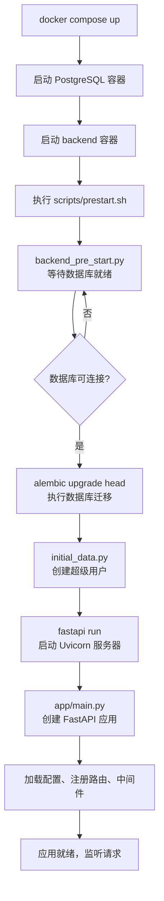
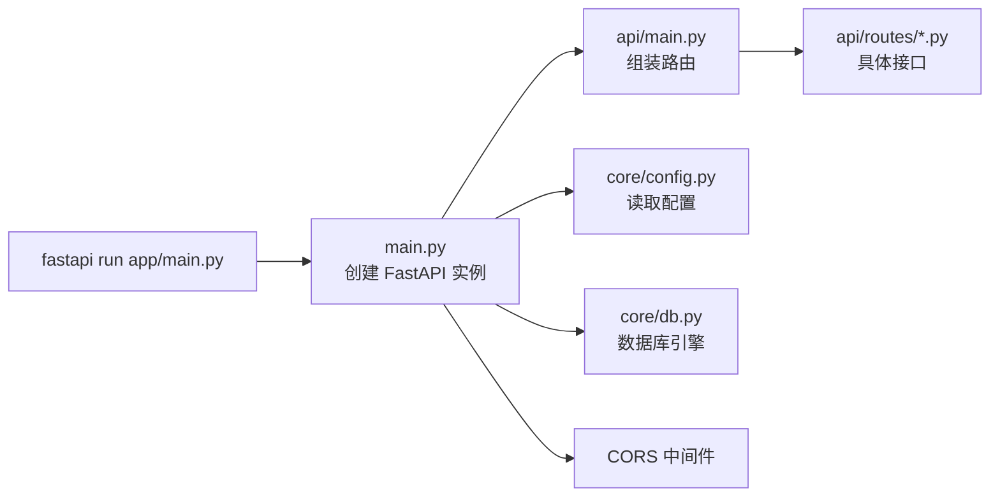
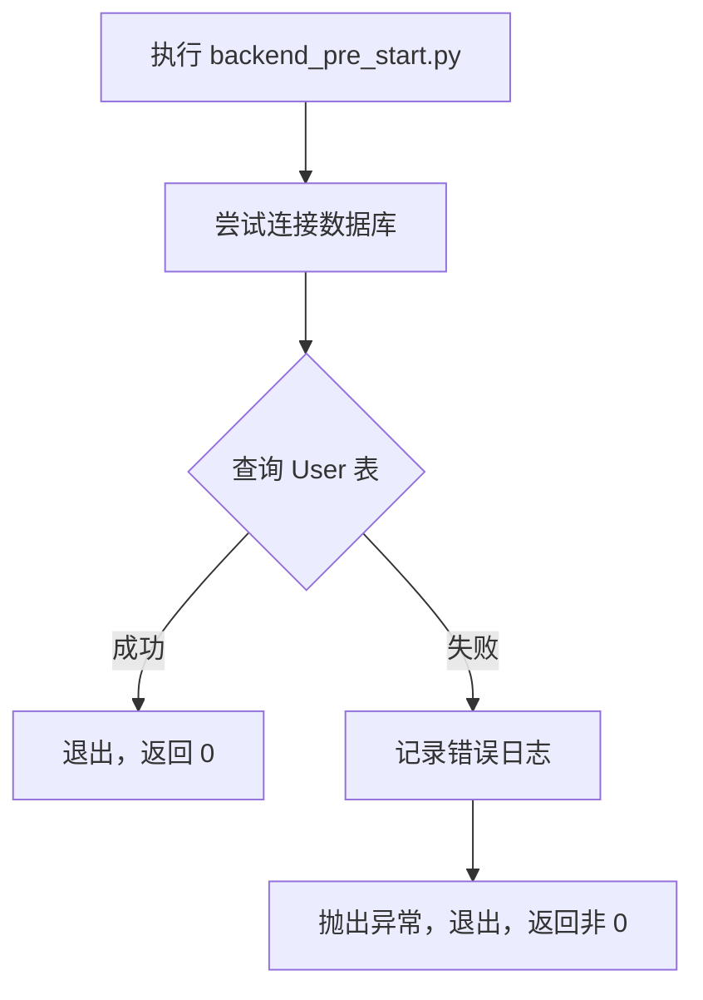
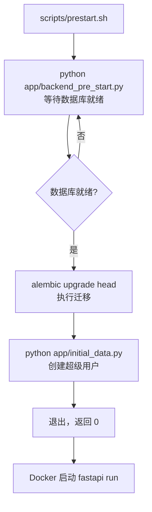
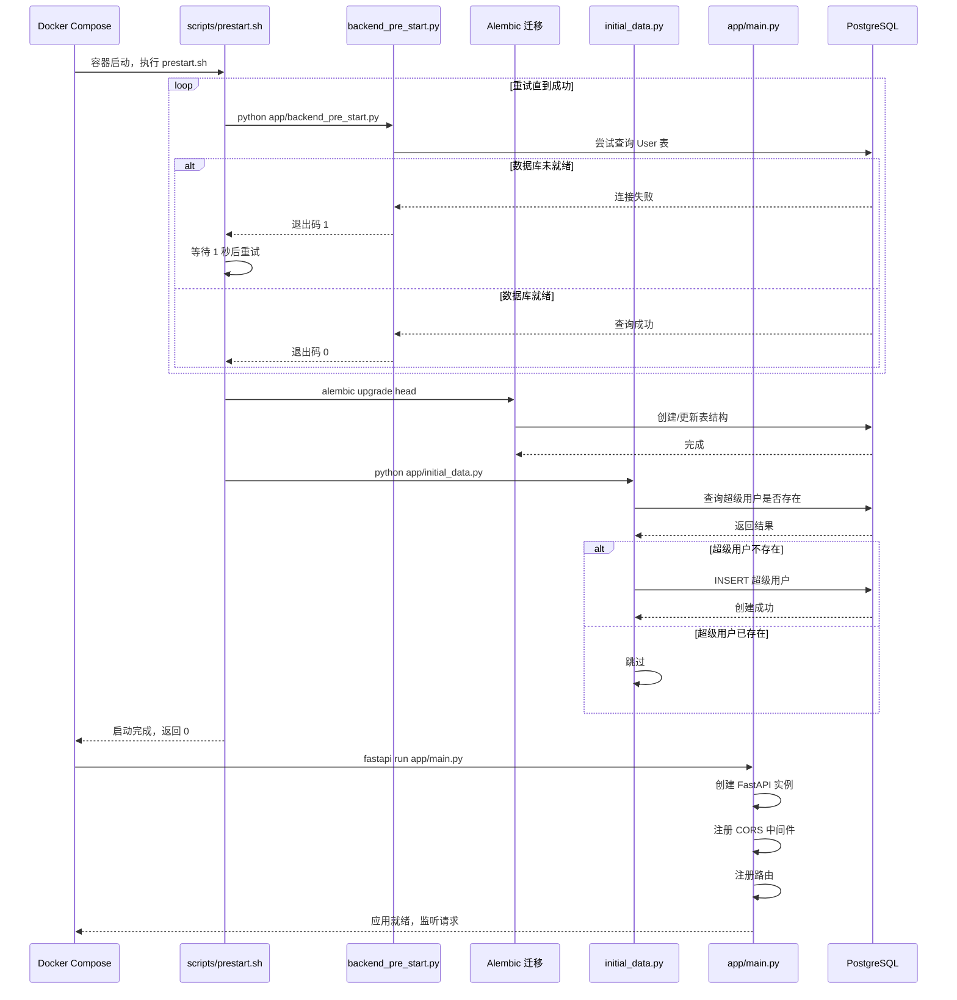

---
# ==========================================
# 系列文章模板 - 用于 Full Stack FastAPI Template
# 使用方法: ./new-chapter.sh "章节标题"
#          .\New-Chapter.ps1 "数字. 章节标题"
# ==========================================

# 标题: 自动从文件名生成，将 "-" 替换为空格并转为标题格式
title: "11 应用入口与启动流程main.py_预启动脚本"

# 日期: 自动填充当前时间
date: 2026-06-26T15:04:33+08:00

# 草稿状态: 新文章默认为草稿，防止未完成内容被发布
# draft: true

# 系列名称: 固定值，用于将同一系列的文章关联起来
series: "Full Stack FastAPI Template"

# 章节权重: 控制文章在系列中的显示顺序，数字越小越靠前
# 脚本会自动根据你输入的章节号设置此值
weight: 11

# 章节编号: 便于在文章中引用和显示
chapter: "11"

# 文章描述: 简要介绍本章内容
description: "深入 app/main.py、backend_pre_start.py、initial_data.py 和 scripts/prestart.sh，拆解 FastAPI 应用从启动到就绪的完整流程"

# 封面图片: 建议将图片放在同章节文件夹内，作为页面资源引用
image: "cover.jpg"

# 分类与标签: 用于网站的分类导航
categories: ["project"]
tags: ["FastAPI", "全栈开发", "Python"]

# 其他可选配置
# comments: true   # 是否开启评论
# math: false      # 是否需要数学公式支持
# license: ""      # 文章底部显示自定义许可证信息
# slug: ""         # 自定义URL，若不填则使用文件夹名
# links：[]        # 文章末尾显示外部链接列表
# aliases：[]      # 允许你为该页面设置多个 URL, 定义哪些旧的链接需要跳转到新文章（放置“路标”指向新地址）
# toc: false       # 关闭文章的目录

---


<!--more-->

## 本章导读

前几篇我们走完了所有核心模块：
- `core/`：配置、安全、数据库引擎
- `models.py` + `crud.py`：数据层
- `api/`：路由、依赖注入、业务接口

现在是时候看 **“应用如何启动”** 了。

一个 FastAPI 应用从执行 `fastapi run` 到能够接收请求，中间经历了什么？`app/main.py`、`backend_pre_start.py`、`initial_data.py` 和 `scripts/prestart.sh` 这几个文件分别扮演了什么角色？

这一章，我们把这些零散的启动环节串成一条完整的链路。

---

## 一、启动流程全景图



---

## 二、app/main.py：FastAPI 应用入口

`main.py` 是整个后端应用的**入口文件**——`fastapi run app/main.py` 启动的就是这个文件。

### 2.1 完整源码

```python
from contextlib import asynccontextmanager
from typing import Any

from fastapi import FastAPI
from fastapi.middleware.cors import CORSMiddleware

from app.api.main import api_router
from app.core.config import settings


@asynccontextmanager
async def lifespan(app: FastAPI) -> Any:
    # 启动时执行
    yield
    # 关闭时执行


app = FastAPI(
    title=settings.PROJECT_NAME,
    openapi_url=f"{settings.API_V1_STR}/openapi.json",
    lifespan=lifespan,
)

# ============================================================
# CORS 中间件（跨域资源共享）
# ============================================================

if settings.BACKEND_CORS_ORIGINS:
    app.add_middleware(
        CORSMiddleware,
        allow_origins=[str(origin) for origin in settings.BACKEND_CORS_ORIGINS],
        allow_credentials=True,
        allow_methods=["*"],
        allow_headers=["*"],
    )

# ============================================================
# 注册路由
# ============================================================

app.include_router(api_router, prefix=settings.API_V1_STR)
```

### 2.2 逐层拆解

#### lifespan：生命周期管理

```python
@asynccontextmanager
async def lifespan(app: FastAPI) -> Any:
    # 启动时执行
    yield
    # 关闭时执行
```

`lifespan` 是 FastAPI 的生命周期管理器：

| 阶段 | 执行时机 | 典型用途 |
| :--- | :--- | :--- |
| `yield` 之前 | 应用启动时 | 初始化数据库连接池、加载缓存 |
| `yield` 之后 | 应用关闭时 | 关闭连接池、清理资源 |

在这个项目中，`lifespan` 没有添加额外逻辑——因为数据库引擎已经在 `core/db.py` 中作为全局单例创建了。但你可以在这里扩展，比如启动时加载 Redis 连接、预热缓存等。

#### FastAPI 实例化

```python
app = FastAPI(
    title=settings.PROJECT_NAME,
    openapi_url=f"{settings.API_V1_STR}/openapi.json",
    lifespan=lifespan,
)
```

- `title`：API 文档的标题，来自 `settings.PROJECT_NAME`。
- `openapi_url`：OpenAPI JSON 文件的路径，默认是 `/openapi.json`，这里改为 `/api/v1/openapi.json`，与实际 API 前缀保持一致。

#### CORS 中间件

```python
app.add_middleware(
    CORSMiddleware,
    allow_origins=[str(origin) for origin in settings.BACKEND_CORS_ORIGINS],
    allow_credentials=True,
    allow_methods=["*"],
    allow_headers=["*"],
)
```

- **CORS（跨域资源共享）**：允许前端（运行在 `http://localhost:5173`）调用后端 API。
- `allow_origins`：来自 `settings.BACKEND_CORS_ORIGINS`，支持逗号分隔的字符串或列表。
- `allow_credentials=True`：允许携带 Cookie/认证信息。
- 如果不配置 CORS，浏览器会阻止前端 JavaScript 跨域请求后端。

#### 注册路由

```python
app.include_router(api_router, prefix=settings.API_V1_STR)
```

- 将 `api/main.py` 中组装好的 `api_router` 挂载到应用上。
- 最终所有路由都带有 `/api/v1` 前缀。

### 2.3 main.py 在整个项目中的位置



---

## 三、backend_pre_start.py：启动前检查

### 3.1 完整源码

```python
import logging

from sqlmodel import Session, select

from app.core.db import engine
from app.models import User

logging.basicConfig(level=logging.INFO)
logger = logging.getLogger(__name__)


def main() -> None:
    logger.info("Initializing service")
    try:
        with Session(engine) as session:
            # 尝试查询 User 表，验证数据库是否可用
            session.exec(select(User)).first()
    except Exception as e:
        logger.error(e)
        raise e


if __name__ == "__main__":
    main()
```

### 3.2 这个文件在做什么？

它的核心逻辑极其简单：**尝试查询数据库，直到成功为止**。



**为什么需要这个文件？**

在 Docker Compose 环境中，PostgreSQL 容器可能需要几秒钟才能完全启动。如果 `prestart.sh` 在数据库就绪前就执行 `alembic upgrade head`，迁移会失败。

`backend_pre_start.py` 被 `prestart.sh` 反复调用，直到数据库可连接为止。它充当了一个**“看门狗”**角色。

### 3.3 实际使用方式

在 `scripts/prestart.sh` 中：

```bash
#!/bin/bash

# 等待数据库就绪
echo "Waiting for database to be ready..."
python app/backend_pre_start.py || exit 1

# 执行迁移
echo "Running database migrations..."
alembic upgrade head

# 初始化数据
echo "Initializing data..."
python app/initial_data.py
```

---

## 四、initial_data.py：初始化超级用户

### 4.1 完整源码

```python
import logging

from sqlmodel import Session, select

from app import crud
from app.core.config import settings
from app.core.db import engine
from app.models import User, UserCreate

logging.basicConfig(level=logging.INFO)
logger = logging.getLogger(__name__)


def init() -> None:
    with Session(engine) as session:
        user = session.exec(
            select(User).where(User.email == settings.FIRST_SUPERUSER)
        ).first()

        if not user:
            logger.info("Creating superuser %s", settings.FIRST_SUPERUSER)
            user_in = UserCreate(
                email=settings.FIRST_SUPERUSER,
                password=settings.FIRST_SUPERUSER_PASSWORD,
                is_superuser=True,
            )
            crud.create_user(session=session, user_create=user_in)
        else:
            logger.info("Superuser already exists")


def main() -> None:
    logger.info("Creating initial data")
    init()
    logger.info("Initial data created")


if __name__ == "__main__":
    main()
```

### 4.2 这个文件在做什么？

它的逻辑我们在第 9 篇（`core/db.py`）中已经见过——但 `initial_data.py` 是 **独立可执行的脚本**，通过 `python app/initial_data.py` 调用。

| 步骤 | 操作 | 说明 |
| :--- | :--- | :--- |
| 1 | 查询 `User` 表 | `select(User).where(User.email == settings.FIRST_SUPERUSER)` |
| 2 | 检查是否已存在 | 如果超级用户已存在，跳过 |
| 3 | 创建超级用户 | 调用 `crud.create_user`，密码自动哈希 |
| 4 | 设置 `is_superuser=True` | 赋予管理员权限 |

### 4.3 为什么单独作为一个文件？

`core/db.py` 中的 `init_db` 和 `initial_data.py` 功能有重叠，但分工不同：

| 文件 | 调用方式 | 用途 |
| :--- | :--- | :--- |
| `core/db.py` 中的 `init_db` | 被其他脚本导入调用 | 用于测试环境初始化 |
| `initial_data.py` | 独立执行 `python app/initial_data.py` | 用于生产环境启动时初始化 |

`initial_data.py` 作为一个**独立脚本**，可以在容器启动时单独执行，也可以在部署后手动执行，更加灵活。

---

## 五、scripts/prestart.sh：启动前总控

### 5.1 完整源码

```bash
#!/bin/bash

# 等待数据库就绪
echo "Waiting for database to be ready..."
python app/backend_pre_start.py || exit 1

# 运行数据库迁移
echo "Running database migrations..."
alembic upgrade head

# 初始化数据（创建超级用户）
echo "Initializing data..."
python app/initial_data.py
```

### 5.2 这个脚本在做什么？

它是 Docker 容器启动前的**总控脚本**：



### 5.3 在 Dockerfile 中的调用

```dockerfile
# backend/Dockerfile（简化）
COPY scripts/prestart.sh /app/scripts/
RUN chmod +x /app/scripts/prestart.sh

# 容器启动时执行
CMD ["bash", "scripts/prestart.sh", "&&", "fastapi", "run", "app/main.py"]
```

或者更常见的是在 `compose.yml` 中通过 `command` 覆盖：

```yaml
services:
  backend:
    command: bash -c "scripts/prestart.sh && fastapi run app/main.py"
```

---

## 六、完整启动流程：将所有环节串起来



---

## 七、设计要点总结

| 组件 | 职责 | 关键设计 |
| :--- | :--- | :--- |
| **`app/main.py`** | FastAPI 应用实例 | 配置 CORS、注册路由、生命周期管理 |
| **`backend_pre_start.py`** | 启动前检查 | 循环重试数据库连接，确保就绪 |
| **`initial_data.py`** | 数据初始化 | 幂等创建超级用户 |
| **`scripts/prestart.sh`** | 启动总控 | 按顺序执行：等待 DB → 迁移 → 初始化 → 启动 |

### 关键设计原则

1. **启动顺序的健壮性**：`backend_pre_start.py` 确保数据库就绪后才继续，避免迁移失败。
2. **幂等性**：`initial_data.py` 可以反复执行，不会重复创建超级用户。
3. **关注点分离**：
   - `main.py` 关注**应用配置**
   - `prestart.sh` 关注**启动流程**
   - `backend_pre_start.py` 关注**依赖检查**
   - `initial_data.py` 关注**数据初始化**
4. **环境感知**：`ENVIRONMENT` 配置控制了 `private.router` 的加载，同一份代码适应不同环境。

---

## 八、本章总结

| 问题 | 答案 |
| :--- | :--- |
| 应用从哪启动？ | `fastapi run app/main.py` |
| 数据库迁移什么时候执行？ | 容器启动前，`scripts/prestart.sh` 中调用 `alembic upgrade head` |
| 超级用户什么时候创建？ | 容器启动前，`scripts/prestart.sh` 中调用 `python app/initial_data.py` |
| 如何确保数据库已就绪？ | `backend_pre_start.py` 循环重试查询 User 表 |
| CORS 在哪里配置？ | `app/main.py` 中的 `CORSMiddleware` |

现在，整个后端的启动链路已经完整：

```
docker compose up
    ↓
PostgreSQL 启动
    ↓
backend 容器启动
    ↓
prestart.sh（等待数据库 → 迁移 → 初始化）
    ↓
fastapi run app/main.py
    ↓
FastAPI 实例创建（配置 → CORS → 路由）
    ↓
应用就绪，监听请求
```


---

