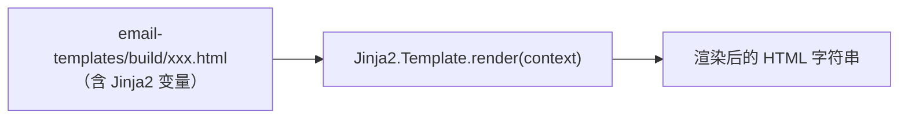
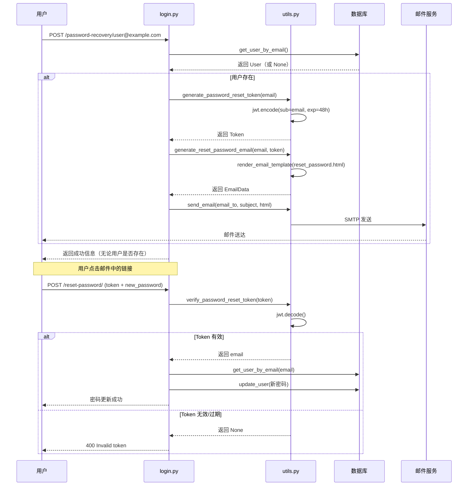
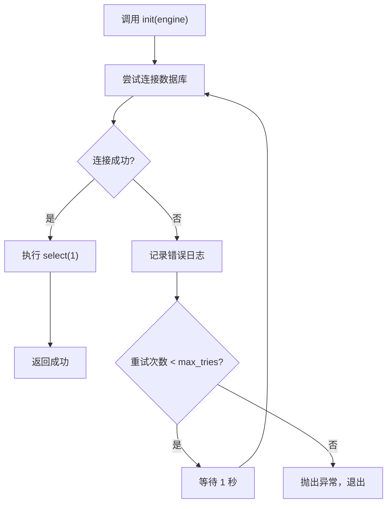
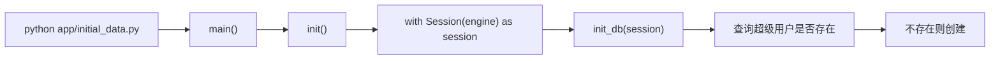

---
# ==========================================
# 系列文章模板 - 用于 Full Stack FastAPI Template
# 使用方法: ./new-chapter.sh "章节标题"
#          .\New-Chapter.ps1 "数字. 章节标题"
# ==========================================

# 标题: 自动从文件名生成，将 "-" 替换为空格并转为标题格式
title: "12 工具函数与预热脚本_utils与预启动文件"

# 日期: 自动填充当前时间
date: 2026-06-26T15:10:06+08:00

# 草稿状态: 新文章默认为草稿，防止未完成内容被发布
# draft: true

# 系列名称: 固定值，用于将同一系列的文章关联起来
series: "Full Stack FastAPI Template"

# 章节权重: 控制文章在系列中的显示顺序，数字越小越靠前
# 脚本会自动根据你输入的章节号设置此值
weight: 12

# 章节编号: 便于在文章中引用和显示
chapter: "12"

# 文章描述: 简要介绍本章内容
description: "收尾 app/ 目录剩余文件：utils.py（邮件发送、密码重置令牌）、backend_pre_start.py 与 tests_pre_start.py（数据库预热）、initial_data.py，完整闭环"

# 封面图片: 建议将图片放在同章节文件夹内，作为页面资源引用
image: "cover.jpg"

# 分类与标签: 用于网站的分类导航
categories: ["project"]
tags: ["FastAPI", "全栈开发", "Python"]

# 其他可选配置
# comments: true   # 是否开启评论
# math: false      # 是否需要数学公式支持
# license: ""      # 文章底部显示自定义许可证信息
# slug: ""         # 自定义URL，若不填则使用文件夹名
# links：[]        # 文章末尾显示外部链接列表
# aliases：[]      # 允许你为该页面设置多个 URL, 定义哪些旧的链接需要跳转到新文章（放置“路标”指向新地址）
# toc: false       # 关闭文章的目录

---


<!--more-->

## 本章导读

前11篇，我们走完了：
- `core/`：配置、安全、数据库引擎
- `models.py` + `crud.py`：数据层
- `api/`：路由、依赖注入、业务接口
- `app/main.py` + `scripts/prestart.sh`：应用入口与启动流程

但 `app/` 目录下还有几个文件没有细看：

```
app/
├── ...
├── backend_pre_start.py   # ⭐ 数据库预热脚本（带重试机制）
├── tests_pre_start.py     # ⭐ 测试环境预热脚本
├── utils.py               # ⭐⭐⭐ 工具函数集（邮件、密码重置令牌）
├── initial_data.py        # ⭐ 数据初始化入口
└── ...
```

> **为什么这一篇要把这些文件合并讲解？**
>
> 和 `api/` 层一样，这几个文件也属于 **“组装”** 和 **“辅助”** 角色：
> - `utils.py` 虽然有 100 多行，但它做的事情是：**用 Jinja2 渲染邮件模板 → 调用 `emails` 库发送 → 用 JWT 生成密码重置令牌**。每一块都在吃前几篇的老本。
> - `backend_pre_start.py` 和 `tests_pre_start.py` 是孪生文件，核心逻辑完全相同，只是服务对象不同。
> - `initial_data.py` 只有 20 行，本质是调用 `core/db.py` 的 `init_db`。
>
> 这三个任务概念密度不高，合并一篇刚好，不会产生信息过载。让我们一次性收尾。


## 一、utils.py：工具函数集

`utils.py` 是整个后端的 **工具百宝箱**——邮件发送、密码重置令牌、模板渲染，都在这里。

### 1.1 完整源码

```python
import logging
from dataclasses import dataclass
from datetime import datetime, timedelta, timezone
from pathlib import Path
from typing import Any

import emails  # type: ignore[import-untyped]
import jwt
from jinja2 import Template
from jwt.exceptions import InvalidTokenError

from app.core import security
from app.core.config import settings

logging.basicConfig(level=logging.INFO)
logger = logging.getLogger(__name__)


@dataclass
class EmailData:
    html_content: str
    subject: str


def render_email_template(*, template_name: str, context: dict[str, Any]) -> str:
    template_str = (
        Path(__file__).parent / "email-templates" / "build" / template_name
    ).read_text()
    html_content = Template(template_str).render(context)
    return html_content


def send_email(
    *,
    email_to: str,
    subject: str = "",
    html_content: str = "",
) -> None:
    assert settings.emails_enabled, "no provided configuration for email variables"
    message = emails.Message(
        subject=subject,
        html=html_content,
        mail_from=(settings.EMAILS_FROM_NAME, settings.EMAILS_FROM_EMAIL),
    )
    smtp_options = {"host": settings.SMTP_HOST, "port": settings.SMTP_PORT}
    if settings.SMTP_TLS:
        smtp_options["tls"] = True
    elif settings.SMTP_SSL:
        smtp_options["ssl"] = True
    if settings.SMTP_USER:
        smtp_options["user"] = settings.SMTP_USER
    if settings.SMTP_PASSWORD:
        smtp_options["password"] = settings.SMTP_PASSWORD
    response = message.send(to=email_to, smtp=smtp_options)
    logger.info(f"send email result: {response}")


def generate_test_email(email_to: str) -> EmailData:
    project_name = settings.PROJECT_NAME
    subject = f"{project_name} - Test email"
    html_content = render_email_template(
        template_name="test_email.html",
        context={"project_name": settings.PROJECT_NAME, "email": email_to},
    )
    return EmailData(html_content=html_content, subject=subject)


def generate_reset_password_email(email_to: str, email: str, token: str) -> EmailData:
    project_name = settings.PROJECT_NAME
    subject = f"{project_name} - Password recovery for user {email}"
    link = f"{settings.FRONTEND_HOST}/reset-password?token={token}"
    html_content = render_email_template(
        template_name="reset_password.html",
        context={
            "project_name": settings.PROJECT_NAME,
            "username": email,
            "email": email_to,
            "valid_hours": settings.EMAIL_RESET_TOKEN_EXPIRE_HOURS,
            "link": link,
        },
    )
    return EmailData(html_content=html_content, subject=subject)


def generate_new_account_email(
    email_to: str, username: str, password: str
) -> EmailData:
    project_name = settings.PROJECT_NAME
    subject = f"{project_name} - New account for user {username}"
    html_content = render_email_template(
        template_name="new_account.html",
        context={
            "project_name": settings.PROJECT_NAME,
            "username": username,
            "password": password,
            "email": email_to,
            "link": settings.FRONTEND_HOST,
        },
    )
    return EmailData(html_content=html_content, subject=subject)


def generate_password_reset_token(email: str) -> str:
    delta = timedelta(hours=settings.EMAIL_RESET_TOKEN_EXPIRE_HOURS)
    now = datetime.now(timezone.utc)
    expires = now + delta
    exp = expires.timestamp()
    encoded_jwt = jwt.encode(
        {"exp": exp, "nbf": now, "sub": email},
        settings.SECRET_KEY,
        algorithm=security.ALGORITHM,
    )
    return encoded_jwt


def verify_password_reset_token(token: str) -> str | None:
    try:
        decoded_token = jwt.decode(
            token, settings.SECRET_KEY, algorithms=[security.ALGORITHM]
        )
        return str(decoded_token["sub"])
    except InvalidTokenError:
        return None
```

### 1.2 模块拆解

#### render_email_template：Jinja2 模板渲染

```python
def render_email_template(*, template_name: str, context: dict[str, Any]) -> str:
    template_str = (
        Path(__file__).parent / "email-templates" / "build" / template_name
    ).read_text()
    html_content = Template(template_str).render(context)
    return html_content
```

**它做的事情**：



- 模板文件在 `email-templates/build/` 目录下。
- 使用 Jinja2 模板引擎，注入 `context` 变量。
- `Path(__file__).parent` 是 `app/` 目录，所以路径最终指向 `app/email-templates/build/`。

#### send_email：邮件发送

```python
def send_email(
    *,
    email_to: str,
    subject: str = "",
    html_content: str = "",
) -> None:
    assert settings.emails_enabled, "no provided configuration for email variables"
    message = emails.Message(
        subject=subject,
        html=html_content,
        mail_from=(settings.EMAILS_FROM_NAME, settings.EMAILS_FROM_EMAIL),
    )
    smtp_options = {"host": settings.SMTP_HOST, "port": settings.SMTP_PORT}
    if settings.SMTP_TLS:
        smtp_options["tls"] = True
    elif settings.SMTP_SSL:
        smtp_options["ssl"] = True
    if settings.SMTP_USER:
        smtp_options["user"] = settings.SMTP_USER
    if settings.SMTP_PASSWORD:
        smtp_options["password"] = settings.SMTP_PASSWORD
    response = message.send(to=email_to, smtp=smtp_options)
    logger.info(f"send email result: {response}")
```

**工作流程**：

| 步骤 | 操作 | 说明 |
| :--- | :--- | :--- |
| 1 | `assert settings.emails_enabled` | 如果邮件未配置，直接报错 |
| 2 | `emails.Message` | 构造邮件对象（主题、HTML内容、发件人） |
| 3 | 构建 SMTP 选项 | 根据配置选择 TLS/SSL、用户名、密码 |
| 4 | `message.send()` | 发送邮件 |

#### generate_password_reset_token：生成密码重置令牌

```python
def generate_password_reset_token(email: str) -> str:
    delta = timedelta(hours=settings.EMAIL_RESET_TOKEN_EXPIRE_HOURS)
    now = datetime.now(timezone.utc)
    expires = now + delta
    exp = expires.timestamp()
    encoded_jwt = jwt.encode(
        {"exp": exp, "nbf": now, "sub": email},
        settings.SECRET_KEY,
        algorithm=security.ALGORITHM,
    )
    return encoded_jwt
```

**关键点**：

| JWT 字段 | 含义 | 说明 |
| :--- | :--- | :--- |
| `exp` | 过期时间（时间戳） | 默认 48 小时后过期 |
| `nbf` | 生效时间（Not Before） | 从当前时间开始生效 |
| `sub` | 主题（用户的 email） | 用于找回用户身份 |

> **注意**：这里用的是 **email** 作为 `sub`，而登录 JWT 用的是 **用户 ID**。这是有意的区分：
> - 登录 Token：`sub=user.id`，用于认证。
> - 密码重置 Token：`sub=user.email`，用于找回用户身份。

#### verify_password_reset_token：验证密码重置令牌

```python
def verify_password_reset_token(token: str) -> str | None:
    try:
        decoded_token = jwt.decode(
            token, settings.SECRET_KEY, algorithms=[security.ALGORITHM]
        )
        return str(decoded_token["sub"])
    except InvalidTokenError:
        return None
```

- 解码成功则返回 email，失败返回 `None`。
- `InvalidTokenError` 包括：签名错误、Token 过期、格式错误。

### 1.3 邮件生成函数

三个 `generate_*_email` 函数结构相同：

```python
def generate_test_email(email_to: str) -> EmailData:
    subject = f"{settings.PROJECT_NAME} - Test email"
    html_content = render_email_template(
        template_name="test_email.html",
        context={"project_name": settings.PROJECT_NAME, "email": email_to},
    )
    return EmailData(html_content=html_content, subject=subject)
```

| 函数 | 模板文件 | 用途 |
| :--- | :--- | :--- |
| `generate_test_email` | `test_email.html` | 测试邮件配置是否正常 |
| `generate_reset_password_email` | `reset_password.html` | 发送密码重置链接 |
| `generate_new_account_email` | `new_account.html` | 新用户注册通知 |

### 1.4 密码重置完整流程图




## 二、backend_pre_start.py：数据库预热

### 2.1 完整源码

```python
import logging

from sqlalchemy import Engine
from sqlmodel import Session, select
from tenacity import after_log, before_log, retry, stop_after_attempt, wait_fixed

from app.core.db import engine

logging.basicConfig(level=logging.INFO)
logger = logging.getLogger(__name__)

max_tries = 60 * 5  # 5 minutes
wait_seconds = 1


@retry(
    stop=stop_after_attempt(max_tries),
    wait=wait_fixed(wait_seconds),
    before=before_log(logger, logging.INFO),
    after=after_log(logger, logging.WARN),
)
def init(db_engine: Engine) -> None:
    try:
        with Session(db_engine) as session:
            # Try to create session to check if DB is awake
            session.exec(select(1))
    except Exception as e:
        logger.error(e)
        raise e


def main() -> None:
    logger.info("Initializing service")
    init(engine)
    logger.info("Service finished initializing")


if __name__ == "__main__":
    main()
```

### 2.2 tenacity 重试装饰器

这是该文件最大的亮点——使用 `tenacity` 库实现**重试逻辑**：

```python
@retry(
    stop=stop_after_attempt(max_tries),   # 最多尝试 300 次（5分钟）
    wait=wait_fixed(wait_seconds),         # 每次间隔 1 秒
    before=before_log(logger, logging.INFO),  # 重试前记录 INFO 日志
    after=after_log(logger, logging.WARN),    # 重试后记录 WARN 日志
)
```

**工作原理**：



**为什么用 `select(1)`？**

`session.exec(select(1))` 是一个轻量级的查询，不依赖任何表——如果数据库连接正常，执行成功；如果连接失败，抛出异常。这是检查数据库是否就绪的最快方式。


## 三、tests_pre_start.py：测试环境预热

### 3.1 源码（与 backend_pre_start.py 几乎相同）

```python
import logging

from sqlalchemy import Engine
from sqlmodel import Session, select
from tenacity import after_log, before_log, retry, stop_after_attempt, wait_fixed

from app.core.db import engine

logging.basicConfig(level=logging.INFO)
logger = logging.getLogger(__name__)

max_tries = 60 * 5  # 5 minutes
wait_seconds = 1


@retry(
    stop=stop_after_attempt(max_tries),
    wait=wait_fixed(wait_seconds),
    before=before_log(logger, logging.INFO),
    after=after_log(logger, logging.WARN),
)
def init(db_engine: Engine) -> None:
    try:
        with Session(db_engine) as session:
            session.exec(select(1))
    except Exception as e:
        logger.error(e)
        raise e


def main() -> None:
    logger.info("Initializing service")
    init(engine)
    logger.info("Service finished initializing")


if __name__ == "__main__":
    main()
```

### 3.2 与 backend_pre_start.py 的区别

| 对比项 | `backend_pre_start.py` | `tests_pre_start.py` |
| :--- | :--- | :--- |
| **使用场景** | 生产/开发环境启动前 | 测试环境启动前 |
| **调用位置** | `scripts/prestart.sh` | `scripts/tests-start.sh` |
| **重试参数** | 5 分钟，间隔 1 秒 | 5 分钟，间隔 1 秒 |
| **核心逻辑** | 完全相同 | 完全相同 |

两文件的核心逻辑相同，只是服务对象不同——分别被 `prestart.sh` 和 `tests-start.sh` 调用。可以说是 **“孪生兄弟”**。


## 四、initial_data.py：数据初始化入口

### 4.1 完整源码

```python
import logging

from sqlmodel import Session

from app.core.db import engine, init_db

logging.basicConfig(level=logging.INFO)
logger = logging.getLogger(__name__)


def init() -> None:
    with Session(engine) as session:
        init_db(session)


def main() -> None:
    logger.info("Creating initial data")
    init()
    logger.info("Initial data created")


if __name__ == "__main__":
    main()
```

### 4.2 这个文件在做什么？

它只是一个 **“外壳”** ——核心逻辑在 `core/db.py` 的 `init_db` 中：



**为什么需要这个外壳？**

- `core/db.py` 中的 `init_db` 是一个函数，需要传入 `session`。
- `initial_data.py` 负责创建 `session` 并调用 `init_db`，作为**独立可执行的脚本**。
- 这样 `scripts/prestart.sh` 可以直接调用 `python app/initial_data.py`，而不需要写一大段 Python 代码。


## 五、完整收尾：app/ 目录所有文件总览

现在我们可以完整地画出 `app/` 目录的全景图：

```
app/
├── alembic/                    # 数据库迁移（versions/ 存放迁移文件）
│   ├── versions/
│   ├── env.py
│   └── script.py.mako
├── api/                        # ⭐ API 层（已拆解）
│   ├── deps.py
│   ├── main.py
│   └── routes/
│       ├── items.py
│       ├── login.py
│       ├── private.py
│       ├── users.py
│       └── utils.py
├── core/                       # ⭐ 核心基础设施（已拆解）
│   ├── config.py
│   ├── db.py
│   └── security.py
├── email-templates/            # 邮件模板
│   ├── build/                  # 编译后的 HTML
│   └── src/                    # MJML 源文件
├── backend_pre_start.py        # ⭐ 数据库预热（本篇）
├── crud.py                     # ⭐ CRUD 操作（第8篇）
├── initial_data.py             # ⭐ 数据初始化入口（本篇）
├── main.py                     # ⭐ FastAPI 应用入口（第11篇）
├── models.py                   # ⭐ 数据模型（第8篇）
├── tests_pre_start.py          # ⭐ 测试预热（本篇）
├── utils.py                    # ⭐ 工具函数集（本篇）
└── __init__.py
```


## 六、总结

| 文件 | 核心职责 | 关键依赖 |
| :--- | :--- | :--- |
| **`utils.py`** | 邮件发送 + 密码重置令牌 | Jinja2、emails、jwt |
| **`backend_pre_start.py`** | 数据库就绪检查（带重试） | tenacity、SQLModel |
| **`tests_pre_start.py`** | 测试环境数据库检查 | tenacity（同左） |
| **`initial_data.py`** | 数据初始化入口 | `core/db.py` 的 `init_db` |

现在，**整个后端代码已经全部覆盖**。

## 七、后端学习路径回顾

| 阶段 | 篇目 | 覆盖内容 | 概念密度 |
| :--- | :--- | :--- | :--- |
| **配置与安全** | 第6篇 | `core/config.py` | ★★★★★ |
| | 第7篇 | `core/security.py` | ★★★★★ |
| **数据层** | 第8篇 | `models.py` + `crud.py` | ★★★★☆ |
| | 第9篇 | `core/db.py` | ★★★☆☆ |
| **API层** | 第10篇 | `api/` 全层 | ★★★☆☆ |
| **启动与工具** | 第11篇 | `app/main.py` + 启动流程 | ★★★☆☆ |
| | 第12篇 | `utils.py` + 预热脚本 | ★★☆☆☆ |

概念密度逐篇下降，符合“先难后易”的学习曲线。你已从配置管理、密码哈希、JWT、ORM、CRUD、依赖注入、路由设计、启动流程，一路走到工具函数和预热脚本，完成了后端全部核心代码的巡礼。


---
