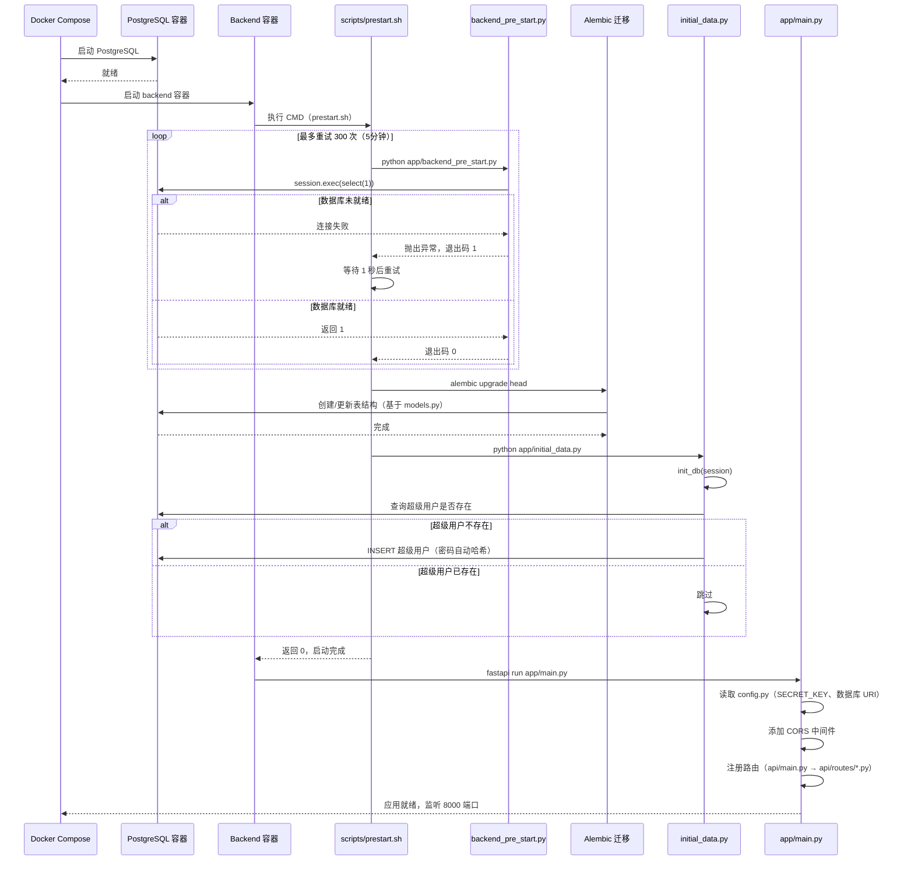
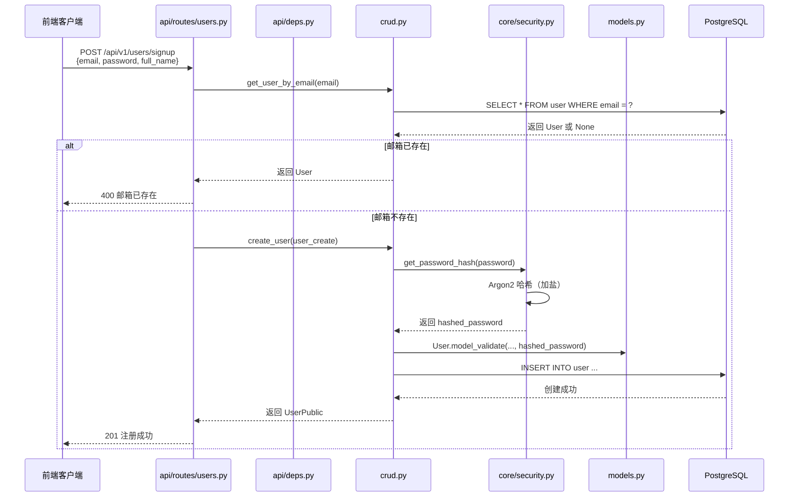
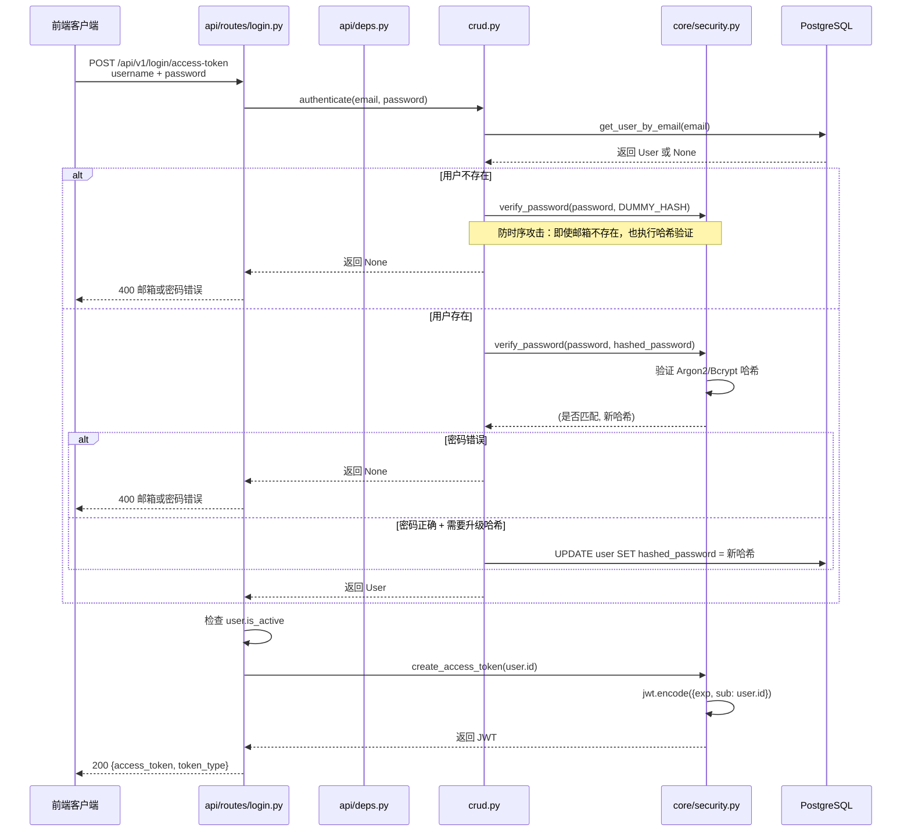
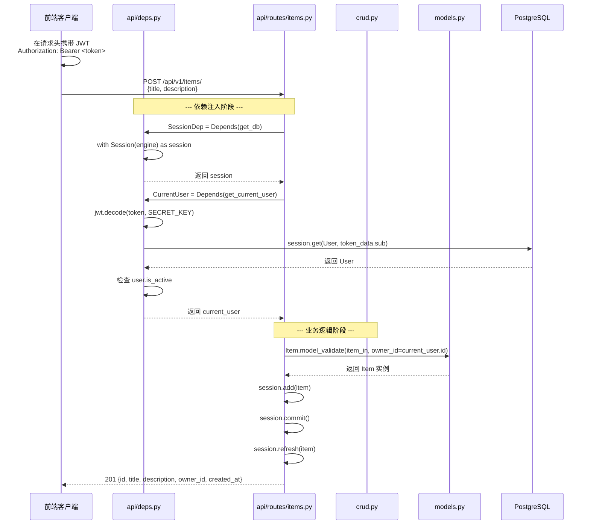
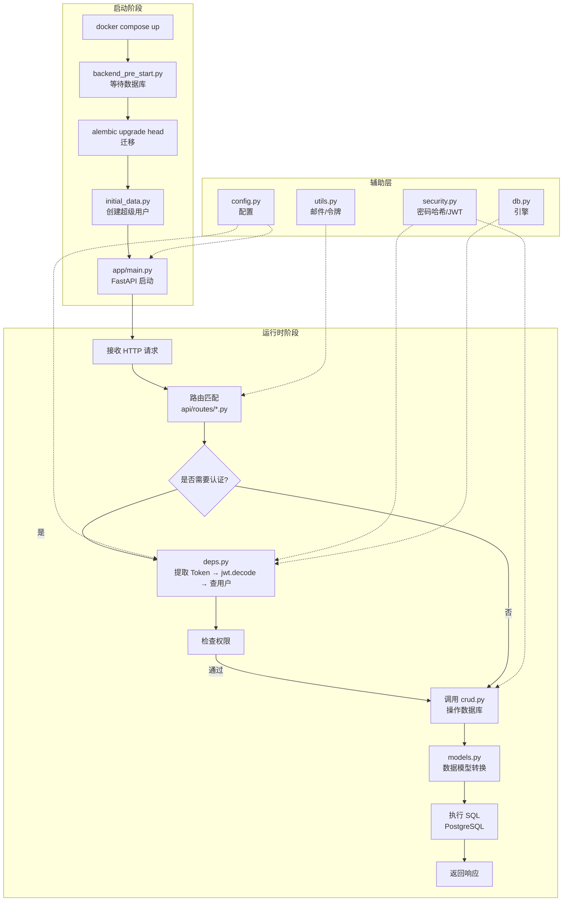
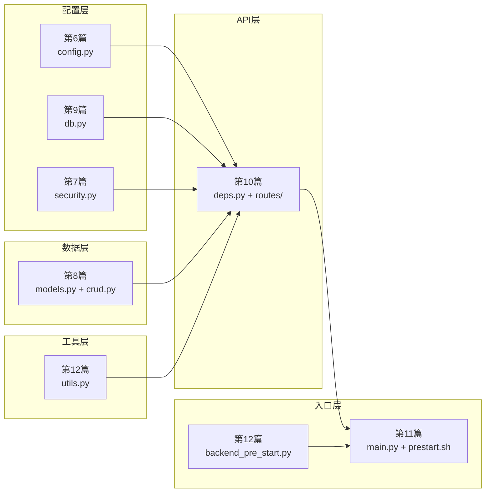

---
# ==========================================
# 系列文章模板 - 用于 Full Stack FastAPI Template
# 使用方法: ./new-chapter.sh "章节标题"
#          .\New-Chapter.ps1 "数字. 章节标题"
# ==========================================

# 标题: 自动从文件名生成，将 "-" 替换为空格并转为标题格式
title: "13 后端总览_一个请求的完整生命周期"

# 日期: 自动填充当前时间
date: 2026-06-26T15:15:40+08:00

# 草稿状态: 新文章默认为草稿，防止未完成内容被发布
# draft: true

# 系列名称: 固定值，用于将同一系列的文章关联起来
series: "Full Stack FastAPI Template"

# 章节权重: 控制文章在系列中的显示顺序，数字越小越靠前
# 脚本会自动根据你输入的章节号设置此值
weight: 13

# 章节编号: 便于在文章中引用和显示
chapter: "13"

# 文章描述: 简要介绍本章内容
description: "用两个完整流程（冷启动 + 运行时请求）串联所有后端模块，从 docker compose up 到 API 响应，每一行代码都有自己的位置"

# 封面图片: 建议将图片放在同章节文件夹内，作为页面资源引用
image: "cover.jpg"

# 分类与标签: 用于网站的分类导航
categories: ["project"]
tags: ["FastAPI", "全栈开发", "Python"]

# 其他可选配置
# comments: true   # 是否开启评论
# math: false      # 是否需要数学公式支持
# license: ""      # 文章底部显示自定义许可证信息
# slug: ""         # 自定义URL，若不填则使用文件夹名
# links：[]        # 文章末尾显示外部链接列表
# aliases：[]      # 允许你为该页面设置多个 URL, 定义哪些旧的链接需要跳转到新文章（放置“路标”指向新地址）
# toc: false       # 关闭文章的目录

---

这是后端部分的收官之作——**用两个完整的流程，串起我们学过的所有后端模块**。


<!--more-->

## 本章导读

前12篇，我们把整个后端代码**逐块拆解**了一遍：

| 篇目 | 文件 | 核心主题 |
| :--- | :--- | :--- |
| 第6篇 | `core/config.py` | 配置管理：Pydantic Settings + 安全校验 |
| 第7篇 | `core/security.py` | 密码哈希（Argon2/Bcrypt）+ JWT 生成 |
| 第8篇 | `models.py` + `crud.py` | 数据模型 + 数据库操作（含防时序攻击） |
| 第9篇 | `core/db.py` | 数据库引擎 + 初始化 |
| 第10篇 | `api/` 全层 | 依赖注入 + 路由 + 业务接口 |
| 第11篇 | `app/main.py` + 启动流程 | FastAPI 应用入口 + prestart.sh |
| 第12篇 | `utils.py` + 预热脚本 | 邮件发送 + 密码重置令牌 + 数据库就绪检查 |

但现在的问题是：**它们是如何配合工作的？**

这一篇，我们用 **两个完整的流程**，把所有模块串起来：

1. **冷启动流程**：从 `docker compose up` 到应用就绪
2. **运行时请求流程**：从用户注册 → 登录 → 创建物品

读完这一篇，你会清晰地看到：**每一行代码在整个系统中处于什么位置，以及它为什么在那里**。

---

## 一、冷启动流程：从 docker compose up 到应用就绪



### 关键节点详解

| 阶段 | 文件 | 做什么 | 为什么 |
| :--- | :--- | :--- | :--- |
| **等待数据库** | `backend_pre_start.py` | 循环重试 `select(1)`，直到连接成功 | PostgreSQL 启动慢，不能直接执行迁移 |
| **迁移** | `alembic/versions/*.py` | 根据 `models.py` 创建/更新表结构 | 版本可控，生产环境标准做法 |
| **初始化** | `initial_data.py` + `core/db.py` | 查询超级用户，不存在则创建 | 保证系统至少有一个管理员账号 |
| **启动应用** | `app/main.py` | 读取配置 → CORS → 注册路由 | FastAPI 应用实例化，等待请求 |


## 二、运行时请求流程：注册 → 登录 → 创建物品

以下是一个完整业务流程：用户注册 → 登录 → 创建物品，串联所有运行时模块。

### 2.1 注册：用户自助注册



**涉及的模块**：

| 步骤 | 模块 | 文件/函数 |
| :--- | :--- | :--- |
| 路由接收 | `users.py` | `register_user()` |
| 邮箱去重 | `crud.py` | `get_user_by_email()` |
| 密码哈希 | `security.py` | `get_password_hash()` → Argon2 |
| 模型转换 | `models.py` | `UserCreate` → `User` |
| 数据库写入 | `crud.py` | `create_user()` → `session.commit()` |

### 2.2 登录：获取 JWT



**涉及的模块**：

| 步骤 | 模块 | 文件/函数 |
| :--- | :--- | :--- |
| 路由接收 | `login.py` | `login_access_token()` |
| 认证逻辑 | `crud.py` | `authenticate()` |
| 密码验证 | `security.py` | `verify_password()` |
| 防时序攻击 | `crud.py` | `DUMMY_HASH` |
| 自动哈希升级 | `crud.py` + `security.py` | `verify_and_update()` |
| JWT 生成 | `security.py` | `create_access_token()` |
| 配置读取 | `config.py` | `settings.ACCESS_TOKEN_EXPIRE_MINUTES` |

### 2.3 创建物品：认证后的 CRUD



**涉及的模块**：

| 步骤 | 模块 | 文件/函数 |
| :--- | :--- | :--- |
| Token 提取 | `deps.py` | `reusable_oauth2` |
| JWT 验证 | `deps.py` | `get_current_user()` → `jwt.decode()` |
| 用户查询 | `deps.py` | `session.get(User, sub)` |
| 权限检查 | `deps.py` | `user.is_active` |
| 模型注入 | `items.py` | `Item.model_validate(..., owner_id=...)` |
| 数据库写入 | `items.py` | `session.add()` + `commit()` |


## 三、模块协作全景图

把冷启动和运行时请求合在一起，就是整个后端的完整图景：




## 四、每篇博文在总览中的位置



| 篇目 | 在总览中的角色 |
| :--- | :--- |
| **第6篇** | 提供配置源（SECRET_KEY、数据库 URI、CORS 来源） |
| **第7篇** | 提供密码哈希和 JWT 能力 |
| **第8篇** | 提供数据模型和 CRUD 操作 |
| **第9篇** | 提供数据库引擎和连接 |
| **第10篇** | 提供依赖注入和业务接口（API 的门面） |
| **第11篇** | 负责应用启动和路由注册 |
| **第12篇** | 提供辅助工具（邮件、预热、初始化） |


## 五、设计哲学总结

回顾整个后端，这个项目的核心设计哲学可以概括为四句话：

### 1. 分层隔离，职责单一

```
api/routes/  →  接收 HTTP 请求，调用下层
    ↓
crud.py      →  数据库操作封装
    ↓
models.py    →  数据模型定义
    ↓
core/db.py   →  数据库连接
```

每一层只做自己的事，不越界。

### 2. 安全默认，渐进升级

- `SECRET_KEY` 自动生成 → 开箱即安全
- 非 local 环境强制替换 `changethis` → 生产环境不将就
- Argon2 + Bcrypt 双哈希 → 新用户用最强算法，老用户自动升级
- 防时序攻击 → 邮箱不存在也执行哈希验证

### 3. 依赖注入，松耦合

```python
def create_item(
    session: SessionDep,        # 数据库会话，由 deps 注入
    current_user: CurrentUser,  # 当前用户，由 deps 注入
    item_in: ItemCreate,        # 请求体，自动解析
) -> Any:
    # 业务逻辑
```

路由函数只关心业务，不关心“如何获取 session”或“如何验证 Token”。

### 4. 配置驱动，环境感知

- `.env` 控制一切
- `ENVIRONMENT=local/staging/production` 决定行为
- `private.router` 只在本地加载


## 六、写在最后

**从第1篇的 README.md 翻译，到第13篇的完整总览，我们走完了整个 FastAPI 后端的全部核心代码。**

这一路走来，我们：

- ✅ 翻译了所有核心文档
- ✅ 解析了配置管理、安全、数据层、API层、启动流程
- ✅ 理清了 JWT、密码哈希、CRUD、依赖注入、数据库迁移
- ✅ 画出了从 `docker compose up` 到 API 响应的完整链路

现在，你已经拥有了这个项目后端的**完整地图**。当你需要修改某个功能时，你不再需要在文件间茫然穿梭——你知道该去哪里，也知道那里有什么。


---

